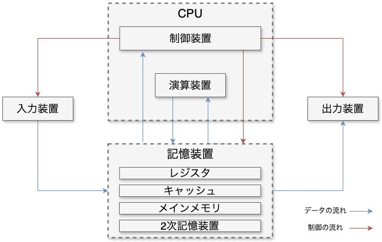

# コンピュータの構成と命令の実行

今回は、現代のコンピュータの構成と、そのコンピュータでプログラム (命令) がどのように実行されているのかを見ていきます。

## コンピュータの基本構造

コンピュータは下の図に示すように、大きく分けると制御装置、演算装置、記憶装置、入力装置、出力装置の 5 つの部品で構成されています。

    

### 入力装置

入力装置は、コンピュータに対してデータや情報、指示を与えるための装置です。
人間が操作するキーボードやマウス、タッチパネルが該当します。

### 出力装置

出力装置は、コンピュータで処理した内容を、人間が理解できるように提示する装置です。
ディスプレイやプリンタ、スピーカなどが該当します。

### 制御装置

制御装置は、その他の装置の制御を担う装置です。
演算装置と合わせて CPU の構成要素となっています。

### 演算装置

演算装置は、記憶装置にあるデータに対して算術演算や論理演算を行う装置です。
制御装置と合わせて CPU の中核をなします。

### 記憶装置

記憶装置は、実行するプログラムや入力されたデータ、演算結果などを保持する装置です。
レジスタをはじめいくつかの階層に分かれており、詳細は自説で説明します。

## 記憶装置の構成

## プログラムの実行