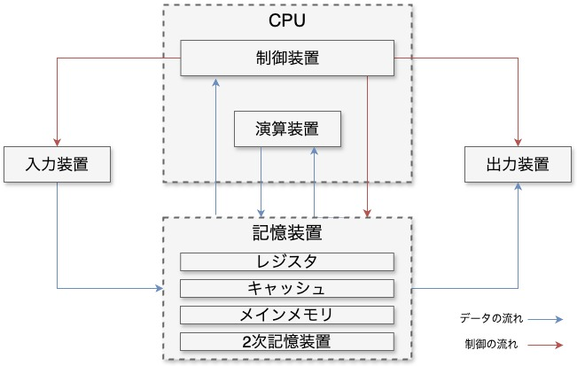

# コンピュータの構成

今回は、現代のコンピュータの構成について見ていきます。

## コンピュータの基本構造

コンピュータは下の図に示すように、大きく分けると制御装置、演算装置、記憶装置、入力装置、出力装置の 5 つの部品で構成されています。

    

### 入力装置

入力装置は、コンピュータに対してデータや情報、指示を与えるための装置です。
人間が操作するキーボードやマウス、タッチパネルが該当します。

### 出力装置

出力装置は、コンピュータで処理した内容を、人間が理解できるように提示する装置です。
ディスプレイやプリンタ、スピーカなどが該当します。

### 制御装置

制御装置は、その他の装置の制御を担う装置です。
演算装置と合わせて CPU の構成要素となっています。

### 演算装置

演算装置は、記憶装置にあるデータに対して算術演算や論理演算を行う装置です。
制御装置と合わせて CPU の中核をなします。

### 記憶装置

記憶装置は、実行するプログラムや入力されたデータ、演算結果などを保持する装置です。
レジスタをはじめいくつかの階層に分かれており、詳細は自説で説明します。

## 記憶装置の構成
一般的に記憶装置はメモリと呼ばれ、アクセス速度や容量によっていくつかの階層に分かれています。
以下の表に、一般的なコンピュータに搭載されるメモリの種類を示します。

| 種類 | 揮発性/不揮発性 | 説明 |
| :--: | :--: | :-- |
| レジスタ | 揮発性 | D Flip Flop (DFF) |
| キャッシュ | 揮発性 | Static Random Access Memory (SRAM) |
| メインメモリ | 揮発性 | Dynamic Random Access Memory (DRAM) |
| ストレージ | 不揮発性 | Hard Disk Drive (HDD), Solid State Drive (SSD) など |

表中、上位のメモリほど高速・小容量で、階層が下がるにしたがって低速・大容量となります。
また、ストレージ以外のメモリは揮発性で、電源を切ると保持していたデータが失われます。

### レジスタ

プロセッサの内部に組み込まれるメモリで、RISC-V の仕様では32ビット、または64ビットの汎用レジスタが32本 (RV32E は16本) 搭載されています。
GPU のように数万個のレジスタが搭載されている例もありますが、一般的なプロセッサでは数十個程度です。  

### キャッシュ
CPU (レジスタ) とメインメモリの中間にあって、アクセス頻度の高いデータや命令を保持するメモリです。
以前はプロセッサの外に実装されていましたが、微細化技術の進展や処理速度の向上に伴って、ほとんどの場合、プロセッサ内部に実装されています。
また、キャッシュ内にもいくつかの階層があり、高速・小容量のものから L1 キャッシュ、L2 キャッシュ、・・・と名前がついています。
最近では L3 キャッシュまで持つ CPU が登場しています。
容量は数十 KB から数百 MB と、キャッシュの階層やプロセッサによって大きく異なります。

### メインメモリ
主記憶装置とも呼ばれ、CPU で実行するプログラムやデータを保持する役割を持つメモリです。
CPU の外部に実装され、DDR4 や DDR5 などの規格が存在します。
容量は数 GB から数百 GB、サーバ用途では TB を超える場合もあります。
基本的にメインメモリのデータはキャッシュを介して CPU に送られるため、CPU から直接メインメモリを操作することはほとんどありません。

### ストレージ
ほかのメモリとは異なり不揮発性で、通電しなくてもデータを保持することができることから、プログラムやデータの長期保存や運搬などに用いられるメモリです。
メインメモリと比べて非常に大きな容量を安価に提供できることが特徴です。
一方、データへのアクセス速度は非常に遅く、メインメモリより $10^3$ から $10^5$ 倍の時間がかかります。
一般的なコンピュータでは、数百 GB 以上のストレージが搭載されることが多くなりました。
