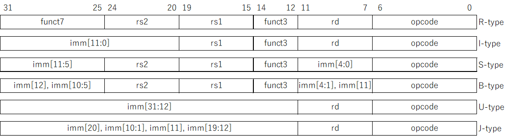

# RISC-V の命令形式
今回は RISC-V の命令形式について見ていきます。

## RISC-V の命令形式
RISC-V は32ビットの固定長命令で、その中に命令の種類やレジスタのアドレスなどの情報を詰め込んでいます。
命令の形式には下の図に示すような R、I、S、B、U、J の6種類があります。

<div align="center">
    
</div>

- ```opcode```  
  すべての命令の下位7ビットに共通するフィールドで、これによって命令のクラスが決まる
- ```rs1```, ```rs2```, ```rd```  
  読み出し元のレジスタ (resister source) と書き出し先のレジスタ (resister destination) のアドレスを表す5ビットのフィールドで、32本のレジスタのうち、どのレジスタを読み書きするかを特定する
- ```funct3```, ```funct7```  
  ```opcode``` や一部の ```imm``` フィールドと組み合わせて命令の種類を特定する
- ```imm```  
  即値 (immediate) のことで、これらのフィールドの値を組み合わせて32ビットの値を生成する

RISC-V では各フィールドの位置を各命令形式で可能な限り共通化することで、命令デコードの回路を単純化できるようになっています。

## 即値の扱い
上記でも述べた通り、```imm``` フィールドの値を適切に組み合わせることで32ビットの即値を生成します。
R 形式を除く5つの命令形式では即値が使われていますが、形式ごとにその生成方法が異なります。
32ビットの命令を　```ir``` として、各形式における即値は以下のように生成されます。

- I 形式: ```{{20{ir[31]}}, ir[31:20]}```  
  2の補数で表現される12ビットの数 ```ir[31:20]``` を32ビットに符号拡張 (```ir[31]```で埋める)
- S 形式: ```{{20{ir[31]}}, ir[31:25], ir[11:7]}```  
  2の補数で表現される12ビットの数 ```{ir[31:25], ir[11:7]}``` を32ビットに符号拡張
- B 形式: ```{{20{ir[31]}}, ir[7], ir[30:25], ir[11:8], 1'b0}```  
  ```{ir[31], ir[7], ir[30:25], ir[11:8]}``` の末尾に ```1'b0``` を追加し、32ビットに符号拡張
- U 形式: ```{ir[31:12], 12'b0}```  
  ```ir[31:12]``` の末尾に12ビット分 ```0``` を連結
- J 形式: ```{{12{ir[31]}}, ir[19:12], ir[20], ir[30:21], 1'b0}```  
  ```{ir[31], ir[19:12], ir[20], ir[30:21]}``` の末尾に ```1'b0``` を追加し、32ビットに符号拡張

