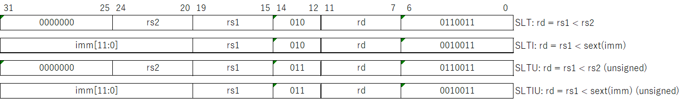
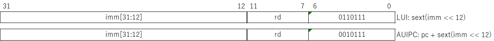

# RV32I の命令
今回は、最もベーシックな命令である RV32I の命令について見ていきます。
RV32I は整数演算を扱う47種類の命令で構成されており、仕様が凍結されているため、原則的に今回出てくる命令たちが変更されることはありません。

## 算術演算命令
RV32I で定義されている算術演算命令は加減算のみで、乗除算については RV32M という別のモジュールで定義されいています。
2つのレジスタ値の演算を行う R 形式の ```ADD``` と ```SUB```、およびレジスタ値と即値の演算を行う I 形式の ```ADDI``` の3種類です。

<div align="center">
    
</div>

上記の表で ```sext()``` は符号拡張を表します。

## 論理演算命令
論理演算として定義されているのは、2つのレジスタ値の演算 ```AND```、```OR```、```XOR``` (R 形式) と、レジスタ値と即値の演算 ```AND```、```OR```、```XOR``` (I 形式) の計6種類です。

<div align="center">
    
</div>

## シフト演算命令
シフト演算として定義されているのは、```rs1``` の値を ```rs2``` だけ左シフト、または右シフトする ```SLL```、```SRL```、```SRA``` (R 形式) と、シフト量を即値で指定する ```SLLI```、```SRLI```、```SRAI``` (I 形式) の計6種類です。

<div align="center">
    
</div>

シフト量は ```rs2``` の下位5ビット、または ```imm``` の下位5ビット (```shamt```) で指定します。
```SLL``` は左シフトで空いた下位ビットを0で埋めます。
```SRL``` と ```SRA``` はともに右シフトですが、```SRL``` はシフトで空いた上位ビットを0で埋める論理シフトであり、```SRA``` は空いたビットをシフト前の最上位ビットで埋める算術シフトです。

## 比較演算命令
比較演算命令は、```rs1``` の値と ```rs2``` または即値の比較を行い、```rs1``` の方が小さい場合に ```rd``` に 1 を、それ以外の場合は 0 を格納する命令です。
R 形式か I 形式を取り、全部で4種類あります。

<div align="center">
    
</div>

"I" の付く命令は即値比較、"U" の付く命令は符号なしでの比較になります。

## ロード命令
ロード命令はメインメモリからデータを読み出す命令です。
ワード (32 ビット) 単位でデータを読み出す ```LW```、ハーフワード (16ビット) 単位で読み出す ```LH``` と ```LHU```、1バイト (8ビット) 単位で読み出す ```LB``` と ```LBU``` の計5種類があります。
命令形式はすべて I 形式です。

<div align="center">
    
</div>

これらの命令では、即値と ```rs1``` に格納された値を加算してメインメモリ上のアドレスを求め、読みだした結果を ```rd``` に格納します。
読み出したデータが32ビットに満たない場合には、32ビットに変換してからレジスタに格納されます。
この時、```LH``` と ```LB``` では符号拡張、```LHU``` と ```LBU``` ではゼロ拡張によって変換が行われます。

## ストア命令
ストア命令はメインメモリにデータを書き出す命令です。
ワード (32 ビット) 単位でデータを書き出す ```SW```、ハーフワード (16ビット) 単位で書き出す  ```SH```、1バイト (8ビット) 単位で書き出す ```SB``` の計3種類があります。
命令形式はすべて S 形式です。

<div align="center">
    
</div>

これらの命令では、即値と ```rs1``` に格納された値を加算してメインメモリ上のアドレスを求め、 ```rs1``` に格納されている値をメインメモリに書き出します。

## 条件分岐命令
条件分岐命令は、```rs1``` と ```rs2``` にそれぞれ格納されている値を比較し、プログラムカウンタ (PC) を更新する命令です。
この命令は全て B 形式で、比較方法によって ```BEQ```、```BNE```、```BLT```、```BGE```、```BLTU```、```BGEU``` の6種類があります。

<div align="center">
    
</div>

```BLTU``` と ```BGEU``` は符号なしで比較を行います。
また、PC の値に命令の即値を加算することで、分岐先の命令のアドレスを計算します。

## ジャンプ命令
ジャンプ命令は、無条件で PC を更新して処理をジャンプする命令です。
ジャンプ命令には J 形式の ```JAL``` と、I 形式の ```JALR``` の2種類があります。

<div align="center">
    
</div>

```JAL``` 命令では現在の PC に即値を加算してジャンプ先の命令アドレスを割り出しますが、```JALR``` の場合には PC の値ではなく ```rs1``` の値に加算します。
ただし、いずれの命令も、```rd``` にはジャンプしなかった場合に次に実行される命令のアドレス ($pc + 4$) が格納されます。

## 即値ロード命令
即値ロード命令は、即値を ```rd``` レジスタに格納する U 形式の命令です。
```LUI``` と ```AUIPC``` の2種類があります。

<div align="center">
    
</div>

```AUIPC``` は PC の相対アドレスを計算するために用いられる命令で、```JALR``` や ```SW```、```LW``` などと組み合わせてメモリ上の任意のアドレスにジャンプしたり、データを読み書きしたりできます。

## CSR 命令
CSR とは "Control and Status Resister" のことで、割り込みや例外処理の管理、仮想メモリの設定に用いる制御レジスタと、CPU の状態を表すステータスレジスタのことを指します。
CSR 命令は6種類あって全て I 形式ですが、即値や ```rs1``` フィールドが特殊な使い方になっています。

<div align="center">
    
</div>

```csr``` で指定されるアドレスに所定のデータを書き込むと同時に、```rd``` にも ```csr``` に格納されていた値を書き込みます。
これらの書き込み処理は同時に実行されます。

## その他の命令
例外処理やメモリ管理を行う命令として、以下の4種類が定義されています。

<div align="center">
    
</div>

- ```ECALL```  
  例外を発生させた上で、システムコールを行う命令
- ```EBREAK```  
  例外を発生させた上で、デバッグモードに移行する命令
- ```FENCE```  
  本来的にはメモリバリアを行う命令だが、RV32I では何もしない命令として扱う
- ```FENCE.I```  
  命令ストリームとデータストリームを同期するための命令