# FPGA の開発環境の整備

FPGA を使った開発を進めるにあたって開発環境を整えます。

## 使用するハードウェアとソフトウェア

### ハードウェアの検討

CPU の自作にあたって、使用するハードウェアとしては以下の選択肢が考えられます。

- ASIC (Application Specific Integrated Circuit)
- 汎用ロジック IC
- CPLD (Complex Programmable Logic Device)
- FPGA (Field Programmable Gate Array)

個人開発においてはあまりにコストがかかりすぎるので、ASIC の作成は除外します。
汎用ロジック IC を使って回路を構築することもできますが、["CPU の創りかた"](https://book.mynavi.jp/ec/products/detail/id=22065) で紹介されている TD4 のような 4bit CPU ならともかく、RISC-V のような 32bit や64bit の CPU を構築するのは非現実的です。
そのため、CPLD か FPGA が選択肢となります。
CPLD も FPGA もロジックを書き換えられるハードウェアである点は共通しています。
CPLD が PAL (Programmable Array Logic) と呼ばれる、 AND/OR ゲートと FF (Flip-Flop) を組み合わせた論理回路を構成要素としている一方、FPGA は LE (Logic Element) と呼ばれる LUT (Look-Up Table) と FF を用いた回路を構成要素としている点で異なります。
また、CPLD は内部の不揮発性メモリにプログラムを書き込みますが、FPGA は揮発性メモリしか持たず、電源投入時に外部の不揮発性メモリからプログラムを読み出しているという違いもあります。
そして最も大きな違い回路規模で、CPLD は数千ゲート程度、FPGA は数万ゲート以上となっています。
自作とはいえ CPU はそれなりの回路規模になりますので、今回は FPGA を利用することにします。  
実は、就職に向けて勉強しようと思って数年前に FPGA を買っていたのですが、何を作るかをちゃんと考えていなかったのでお蔵入りになってしまった FPGA ボード [DE0-CV](https://www.terasic.com.tw/cgi-bin/page/archive.pl?Language=English&No=921) を持っています。
[DE0-CV](https://www.terasic.com.tw/cgi-bin/page/archive.pl?Language=English&No=921) は、Altera (現 Intel) 社の Cyclon V という FPGA を搭載した Terasic 社製のボードです。
Cyclon V は以下のような構成になっています。

| 素子 | 個数 |
| :--: | :--: |
| LE (Logic Element) | 49,000 個 |
| ALM (Adaptive Logic Module) | 18,480 個 |
| メモリブロック | 308 個 (3,080 Kbit) |
| 乗算回路 | 132 個 |
| PLL (Phase Locked Loop) | 4個 |

ALM は8入力 LUT と4個の FF で構成された回路で、LE と比べてより高集積で高速動作が可能です。
Cyclone V では LE の代わりに ALM が搭載されており、上の表の LE 数は換算値になっています。
また、PLL は任意の周波数や移送のクロックを生成するブロックです。

### ハードウェア設計言語の選択

使用するハードウェアは FPGA に決まりましたが、FPGA 上で動かす回路を設計し、FPGA ボードで実行できるようにするソフトウェアも検討する必要があります。
通常、FPGA 上で動かす回路の設計には HDL (Hardware Design Language: ハードウェア設計言語) を用います。
HDL には大きく分けて以下の2種類があります。

- VHDL
- Verilog-HDL

細かな用語や記述方法の際はありますが、どちらを使ったとしても大きな差異はありません。
以降の実装では、Verilog-HDL の機能強化版である SystemVerilog を用いて開発を行います。  
一方、通常のプログラミング言語を使って処理を記述し、ハードウェアロジックに変換する高位合成 (High-level Synthesis) と呼ばれる方法もあります。
C++ ベースの SystemC や、Scala ベースの Chisel などがその代表例です。
書きなれたプログラミング言語で記述できるのが大きな利点となります。
しかし、内部的には SystemC や Chisel のコードをコンパイル (正確にはトランスパイル) して Verilog に変換にしているため、回路の合成に時間がかかる、生成された Verilog の可読性が低いなどのデメリットもあります。
ただ、Chisel は RISC-V の実装に使われているということもあるので、Chisel はたまに使ってみようと思います。

### 統合開発環境

最後に HDL で書かれたソースコードを実行形式に変換して、FPGA に読み込ませてボード上で実行できるようにする統合開発環境を見ていきます。
これは Intel から公式に出されている Quartus Prime を利用します。
また、シミュレーションやデバッグ作業を行う、同じく Intel の Questa も利用します。
いずれも有償エディションもありますが、個人開発には無償版で十分なので、無償版を使います。
一方、通常は Quartus Prime から FPGA に書き込むために USB Blaster や USB Blaster II を使う必要がありますが、DE0-CV にはボード上に実装されています。

## Quartus Prime の導入

統合開発環境として Quartus Prime のインストール方法を見ていきます。

### Quartus Prime Lite エディションのダウンロード

[Quartus Prime 開発環境ソフトウェア](https://www.intel.co.jp/content/www/jp/ja/products/details/fpga/development-tools/quartus-prime/resource.html) のページにアクセスして、Quartus Prime Lite エディションをダウンロードします。

1. 「Installer」タブの「Download」をクリック

<div align="center">
    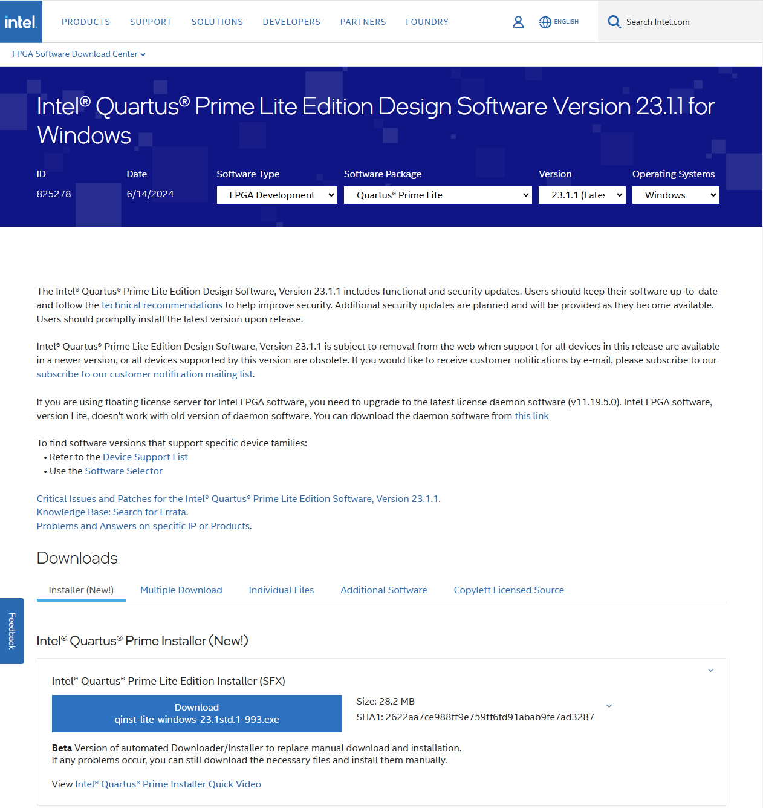
</div>

1. 「Accept」をクリックしてソフトウェアライセンスに同意する

<div align="center">
    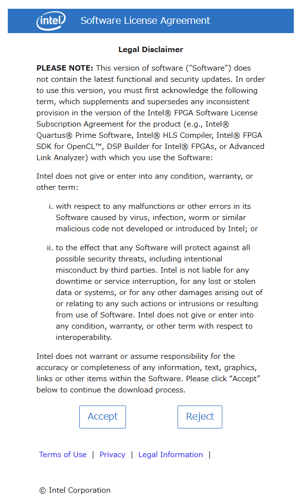
</div>

### Quartus Prime Lite のインストール

前節でダウンロードしたインストーラを実行してインストールを進めます。

- 「Quartus Prime Lite Edition (Free)」にチェック
  - 「Quartus Prime (includes Nios II EDS)」にチェック
  - 「Questa*-Intel FPGA and Starter Editions」と「Starter Edition」にチェック
- 「Devices」の「Cyclone V device support」にチェック
- 「Agree to Intel License Agreement」にチェック
- 「Launch USB Blaster II driver installer」のチェックを外す

<div align="center">
    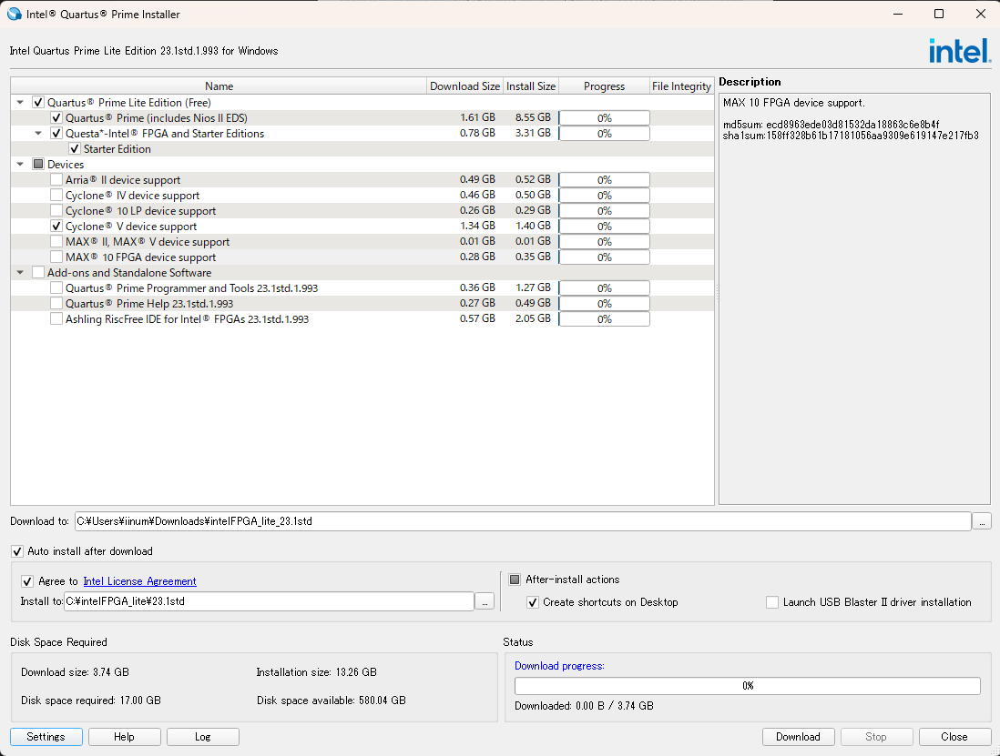
</div>

これで、Quartus と Quaeta の両方がインストールされました。

### USB Blaster のドライバ更新

最後に、DE0-CV に搭載されている USB Blaster のドライバを更新しておきます。
DE0-CV を Windows PC に接続し、電源を入れる (赤いシュッシュボタンを押す) とデバイスマネージャで「USB-Blaster」が認識されます。
右クリックから「ドライバの更新」に進み、「ドライバの検索場所を指定」で ```C:¥intelFPGA_
lite¥<version>¥quartus¥drivers¥usb-blaster``` を選択します。

<div align="center">
    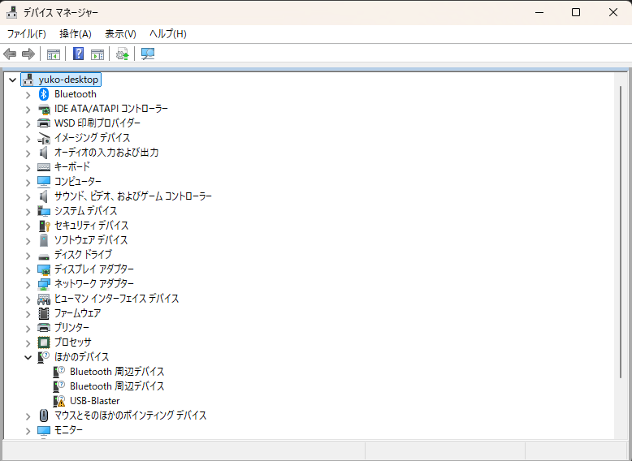
</div>

## 7セグメントデコーダの作成

Quartus Prime Lite と DE0-CV の動作確認を兼ねて、DE0-CV ボード上のスライドスイッチで7セグメント LED を光らせる回路を動かしてみます。

### 設計

ここで作るのは、下の図のように7セグメント LED の a から g の7個の LED を、SW0 から SW3 の4つのスライドスイッチで制御する回路です。

<div align="center">
    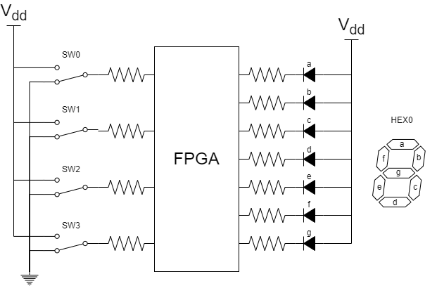
</div>

入力 ```[SW3, SW2, SW1, SW0]``` に対して、表示する文字と出力 ```gfedcba``` の関係は以下の通りです。

| 入力 | 表示 | 出力 |
| :--: | :--: | :--: |
| 0000 | 0 | 1000000 |
| 0001 | 1 | 1111001 |
| 0010 | 2 | 0100100 |
| 0011 | 3 | 0110000 |
| 0100 | 4 | 0011001 |
| 0101 | 5 | 0010010 |
| 0110 | 6 | 0000010 |
| 0111 | 7 | 1011000 |
| 1000 | 8 | 0000000 |
| 1001 | 9 | 0010000 |
| 1010 | A | 0001000 |
| 1011 | B | 0000011 |
| 1100 | C | 1000110 |
| 1101 | D | 0100001 |
| 1110 | E | 0000110 |
| 1111 | F | 0001110 |

### コード

上記の回路を実現する SystemVerilog のコードは以下の通りです。
```always``` 文内で代入する出力信号は ```reg``` 宣言で定義します。

```seg7dec.sv```

```verilog
module SEG7DEC (
    input       [3:0]   SW,
    output  reg [6:0]   HEX0
);

always @* begin
    case (SW)
        4'h0:   HEX0 = 7'b1000000;
        4'h1:   HEX0 = 7'b1111001;
        4'h2:   HEX0 = 7'b0100100;
        4'h3:   HEX0 = 7'b0110000;
        4'h4:   HEX0 = 7'b0011001;
        4'h5:   HEX0 = 7'b0010010;
        4'h6:   HEX0 = 7'b0000010;
        4'h7:   HEX0 = 7'b1011000;
        4'h8:   HEX0 = 7'b0000000;
        4'h9:   HEX0 = 7'b0010000;
        4'ha:   HEX0 = 7'b0001000;
        4'hb:   HEX0 = 7'b0000011;
        4'hc:   HEX0 = 7'b1000110;
        4'hd:   HEX0 = 7'b0100001;
        4'he:   HEX0 = 7'b0000110;
        4'hf:   HEX0 = 7'b0001110;
        default:HEX0 = 7'b1111111;
    endcase  
end
    
endmodule
```

### Quartus Prime でプロジェクトを作成する

1. 「File」から「New Project Wizard...」を選択し、プロジェクト作成ウィザードを開きます。
   <div align="center">
       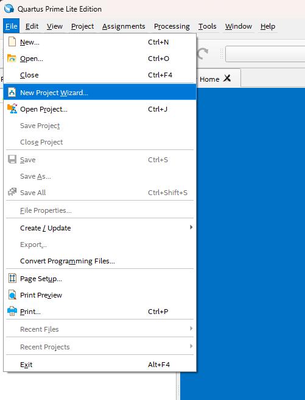
   </div>

2. 「Introduction」ページでは「Next」を選択します。
   <div align="center">
       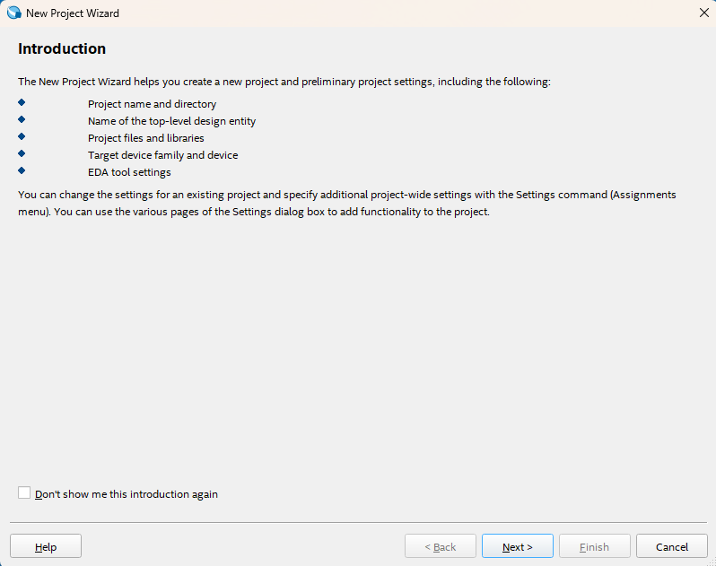
   </div>

3. プロジェクトの保存先フォルダ、プロジェクト名、最上位階層のブロック名を指定します。
   <div align="center">
       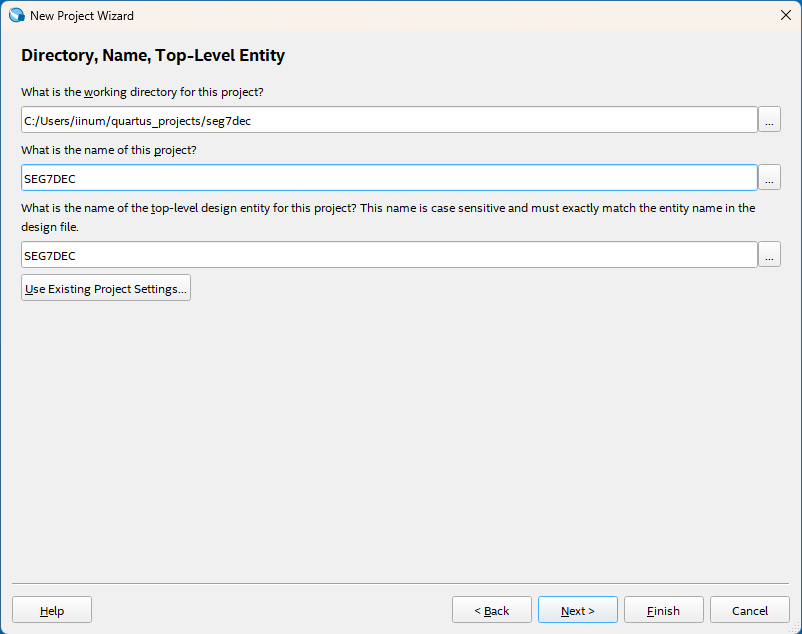
   </div>

4. 「Project Type」は「Empty Project」を選択します。
   <div align="center">
       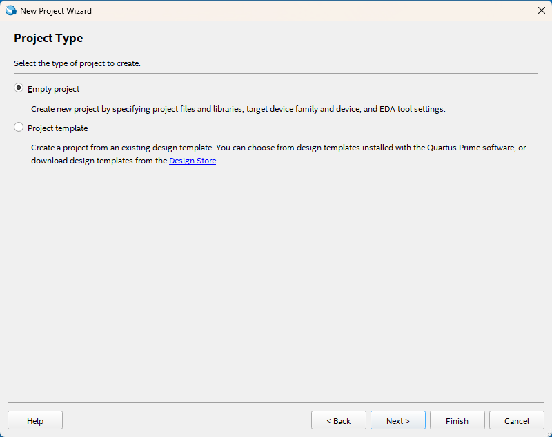
   </div>

5. 「Add Files」では、先ほど作成した ```seg7dec.sv``` を選択します。(後から追加も可能です。)
   <div align="center">
       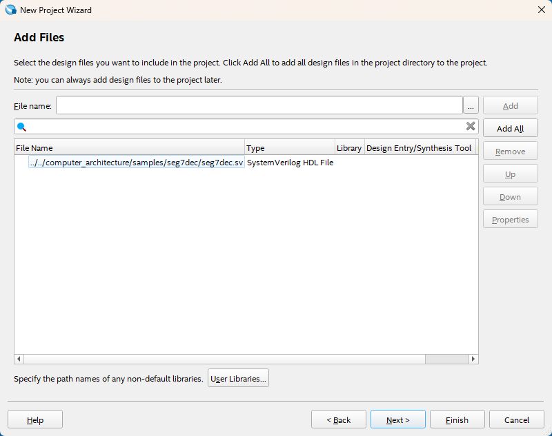
   </div>

6. 「Family, Device & Board Settings」では、「Board」タブから「Family: Cyclone V」、「Development Kit: DE0-CV Development Board」を選択し、「Available boards」に出てきた項目をクリックします。また、下の方にある「Create top-level design file」のチェックを外しておきます。
   <div align="center">
       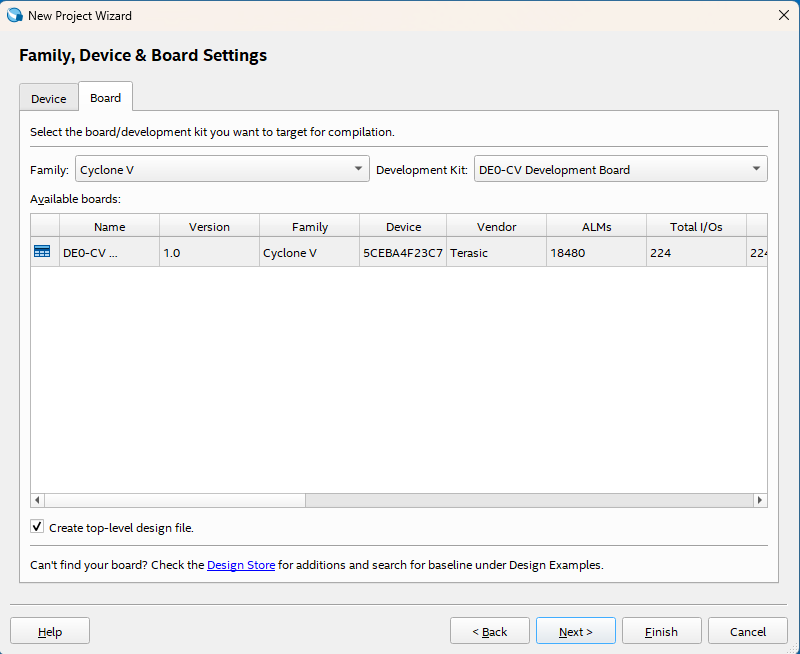
   </div>

7. 「EDA Tool Settings」では、「Simulation」に Questa を指定することもできますが、一旦 None にしておきます。
   <div align="center">
       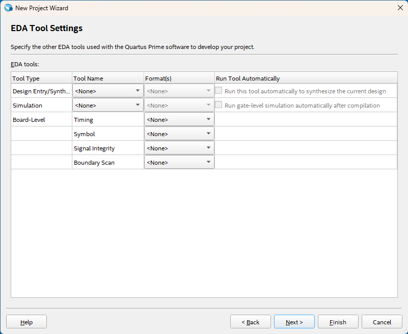
   </div>

8. 「Summary」で設定内容を確認して「Finish」で新規プロジェクトの作成を完了します。
   <div align="center">
       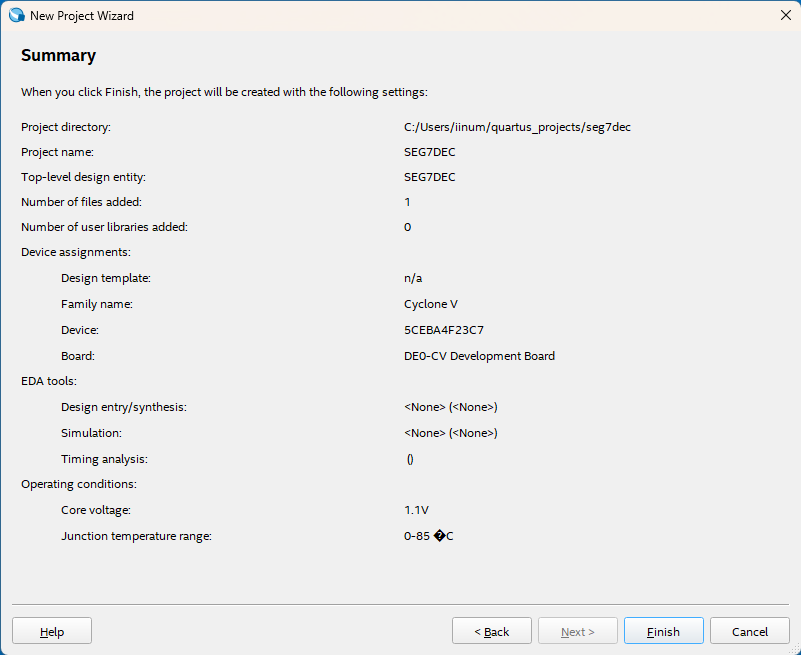
   </div>

### ピンアサインの設定
続いて、FPGA の端子とボード上のスライドスイッチや LED の対応関係を表すピンアサインを設定します。
ピンアサインを設定するには、次のような方法があります。

- Pin Planner を使う
- Assignment Editor を使う
- あらかじめ用意したピンアサインファイルを読み込む

ここでは、簡単のため、参考書に掲載されているピンアサイン (```DE0-CV_pin.qsf```) を使い、3つ目の方法でピンアサインを設定します。
「Assignments」の「Import Assignments...」を選択し、```DE0-CV_pin.qsf``` のパスを選択します。

<div align="center">
    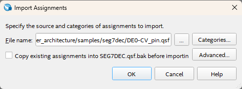
</div>

### コンパイル
以上でコンパイルの準備が完了したので、以下のいずれかの方法でコンパイルを実行します。

- ウィンドウ上段の「Start Compilation」をクリックする
- 「Processing」の「Start Compilation」を選択する

左の「TASK」欄やコンソールにコンパイル状況が表示され、コンパイルが成功すると、```output_files``` フォルダに必要なファイルが生成されます。

<div align="center">
    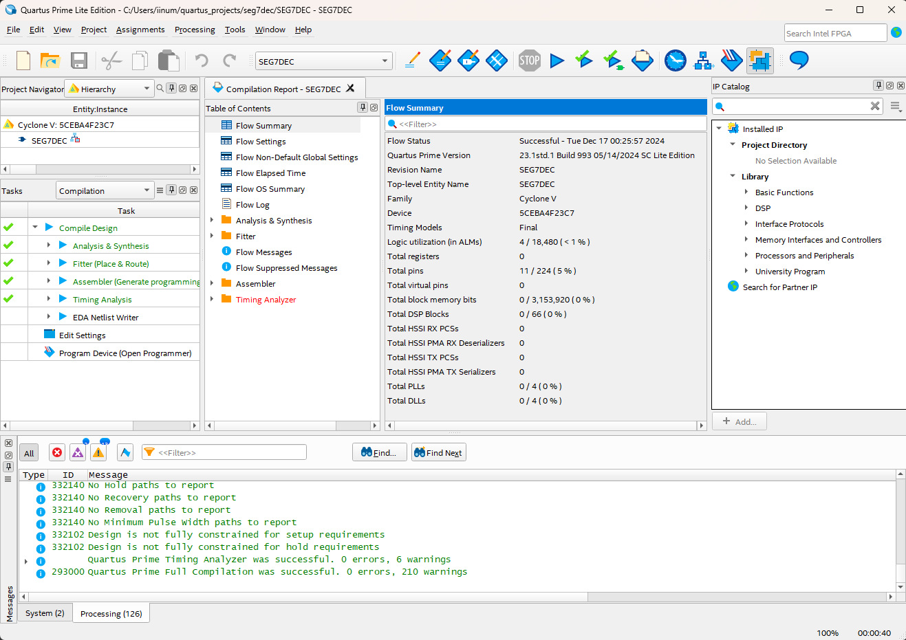
</div>

生成されるファイルは、主に次の通りです。

| ファイル | 内容 |
| :-- | :-- |
| *.qpf | プロジェクトファイル |
| *.qsf | ピンアサインなどの各種設定ファイル |
| output_files/*.sof | コンフィグレーション用のファイル |
| output_files/*.pof | コンフィグレーション ROM 用のファイル |
| output_files/*.rpt | 各種レポートファイル |
| output_files/*.summary | 各種サマリファイル |

### FPGA ボードのコンフィグレーション
最後に、FPGA ボードをパソコンに接続し、コンパイルした回路を読み込ませて動作確認します。

1. Programmer の起動  
ウィンドウ上部の「Programmer」アイコンをクリックするか、「Tools」から「Programmer」を選択します。

<div align="center">
    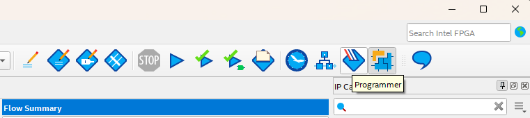
</div>

2. Hardware Setup を開く  
Programmer ウィンドウの「Hardware Setup...」が「No Hardware」になっている場合は、「Hardware Setup...」をクリックして新しいウィンドウを開きます。

<div align="center">
    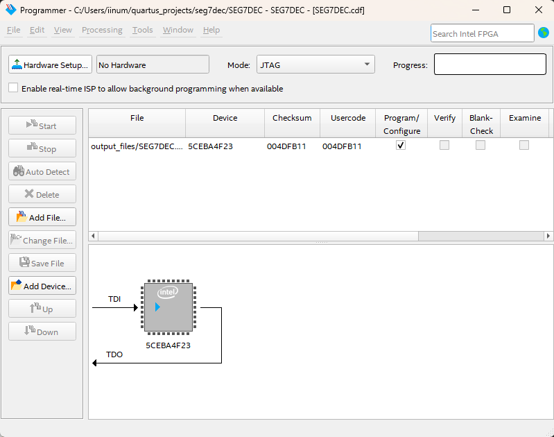
</div>

3. USB-Blaster を選択  
「Currently selected hardware」のプルダウンメニューから「USB-Blaster」を選択します。

<div align="center">
    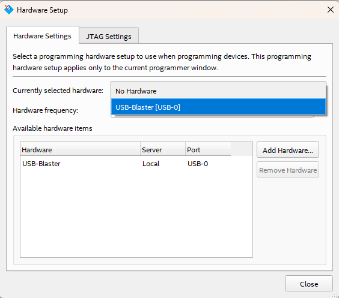
</div>

4. コンフィグレーション開始・動作確認  
Programmer ウィンドウに戻り、左上のほうにある「Start」ボタンを押すと、FPGA のコンフィグレーションが始まり、回路が起動します。
スライドスイッチで操作すると、下の図のように右端の7セグメント LED に文字が表示されます。

<div align="center">
    
</div>