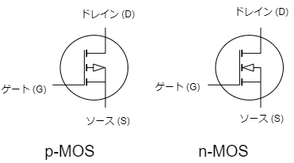
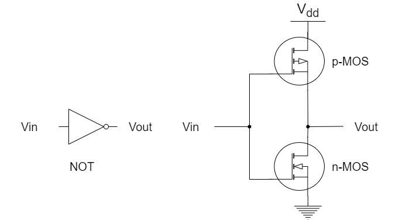
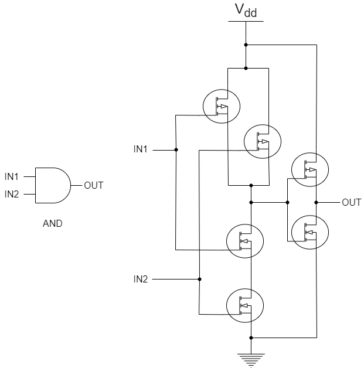
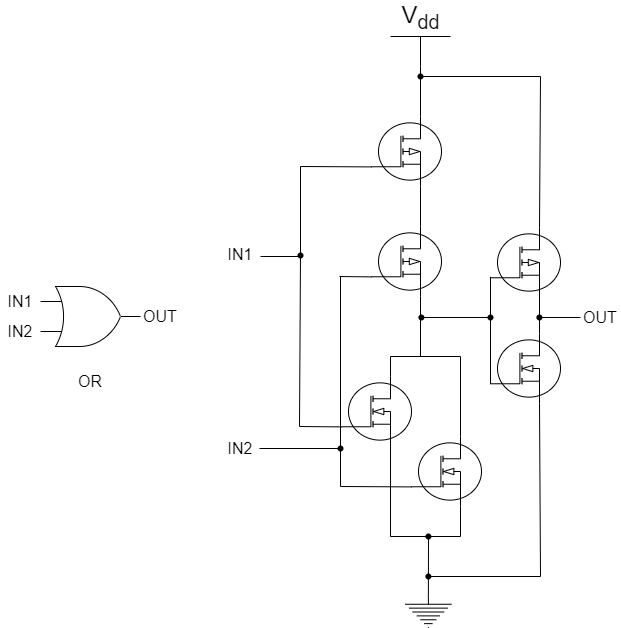
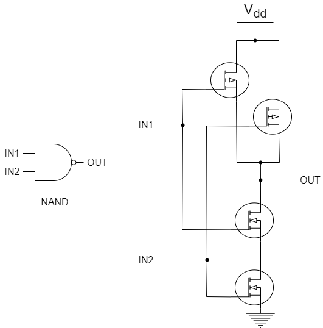
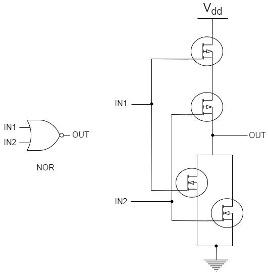
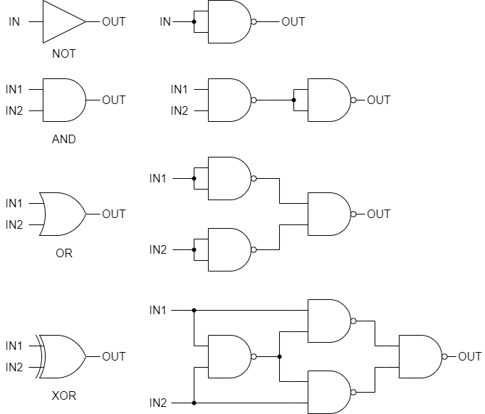

# ブール代数と論理ゲート
前回は FPGA の開発環境を整備して、実際にボード上の 7 セグメント LED を点灯させてみました。
今回は、CPU 作りの基礎として真 (1) と偽 (0) の2値だけを扱うブール代数の理論と、それを電子回路で実現する際に用いる論理ゲートを学びます。

## ブール代数
### アナログとデジタル
この世のほとんどの情報は連続的な値をとるアナログなデータです。
数学的に言えば実数にあたります。
一方、デジタルなデータは実数に対する自然数のように飛び飛びの値、つまり離散的な値をとります。
コンピュータはデジタルなデータを扱うので、取得したアナログなデータをデジタルなデータに変更する必要があります。
ここでは詳しく触れませんが、A/D コンバータ (Analog to Digital Converter) を用いてアナログなデータをデジタルなデータに変換できます。
アナログなデータをアナログなまま処理することもできますが、デジタル化することで次のようなメリットがあります。

- ノイズに強くデータの破損が生じにくい
- データを圧縮できる
- (上記の理由により) 長距離伝送に向いている

このようなメリットから、コンピュータではデジタル化されたデータを扱います。
より具体的には、電圧の高い状態を 1 (真)、低い状態を 0 (偽) として、この2つの値でデータを表現しています。
そこで、1 と 0 の2つの値のみで表されたデータを処理できる理論が必要になります。
その裏付けを与えてくれるのがブール代数です。

### ブール演算子  (Boolean Operator) 
0 と 1 のどちらかの値 (**ブール値**) を取る変数を入力として、出力の真偽 (0 か 1 か) を判定する演算子をブール演算子と呼びます。
基本的なブール演算子としては **AND**、**OR**、**NOT** の3種類が挙げられます。
0 か 1 のどちらかをとる変数 $x$、$y$ を入力とすると、3種類のブール演算子はそれぞれ $x \cdot y$、$x + y$、$\bar{x}$、あるいは $x \land y$、$x \lor y$、$\neg x$ と表します。
また、各入力パターンに対するブール演算子の出力を一覧にした表を**真理値表**と呼びます。
**AND**、**OR**、**NOT** の各演算子の真理値表は以下のように表されます。

$$
\begin{array}{cc||c}
x & y & x \cdot y \\
\hline
0 & 0 & 0 \\
1 & 0 & 0 \\
0 & 1 & 0 \\
1 & 1 & 1 
\end{array}
$$

$$
\begin{array}{cc||c}
x & y & x + y  \\
\hline
0 & 0 & 0 \\
1 & 0 & 1 \\
0 & 1 & 1 \\
1 & 1 & 1 
\end{array}
$$

$$
\begin{array}{c||c}
x & \bar{x} \\
\hline
0 & 1 \\
1 & 0
\end{array}
$$

2変数のブール演算子は以下の通りです。

$$
\begin{array}{cc|cccc}
 & (x, y) & (0, 0) & (0, 1) & (1, 0) & (1, 1) \\
\hline
定数\ 0 & 0 & 0 & 0 & 0 & 0 \\
x\ AND\ y & x \cdot y & 0 & 0 & 0 & 1 \\
x\ AND\ (NOT\ y) & x \cdot \bar{y} & 0 & 0 & 1 & 0 \\
x & x & 0 & 0 & 1 & 1 \\
(NOT\ x)\ AND\ y & \bar{x} \cdot y & 0 & 1 & 0 & 0 \\
y & y & 0 & 1 & 0 & 1 \\
x\ XOR\ y & x \cdot \bar{y} + \bar{x} \cdot y & 0 & 1 & 1 & 0 \\
x\ OR\ y & x + y & 0 & 1 & 1 & 1 \\
x\ NOR\ y & \overline{x + y} & 1 & 0 & 0 & 0 \\
x\ XNOR\ y & x \cdot y + \bar{x} \cdot \bar{y} & 1 & 0 & 0 & 1 \\
NOT\ y & \bar{y} & 1 & 0 & 1 & 0 \\
IF\ y\ THEN\ x & x + \bar{y} & 1 & 0 & 1 & 1 \\
NOT\ x & \bar{x} & 1 & 1 & 0 & 0 \\
IF\ x\ THEN\ y & \bar{x} + y & 1 & 1 & 0 & 1 \\
x\ NAND\ y & \overline{x \cdot y} & 1 & 1 & 1 & 0 \\
定数\ 1 & 1 & 1 & 1 & 1 & 1 
\end{array}
$$

先に紹介した3種類以外にもブール演算子はいくつかありますが、全て AND、OR、NOT の組み合わせで表現できます。

- $x\ XOR\ y = (x\ AND\ (NOT\ y))\ OR\ ((NOT\ x)\ AND\ y)$
- $x\ NOR\ y = NOT(x\ OR\ y)$
- $x\ XNOR\ y = (x\ AND\ y)\ OR\ ((NOT\ x)\ AND\ (NOT\ y))$
- $x\ NAND\ y = NOT(x\ AND\ y)$
- $IF\ y\ THEN\ x = x\ OR\ (NOT\ y)$
- $IF\ x\ THEN\ y = (NOT\ x)\ OR\ y$

2入力の場合、16種類の出力パターンがありますが、一般に $n$ 個の入力には $2^{2^n}$ 通りの出力パターンがあります。

### ブール関数の定義方法
入力としてブール値を取り、ブール演算子を用いた処理を行ってブール値を出力する関数を**ブール関数**と呼びます。
ブール関数を定義するには真理値表を使うこともできますが、$n$ 個の入力がある場合には $2^n$ 通りのパターンを定義する必要があるため、入力数が増えると真理値表が指数関数的に大きくなってしまいます。
そこで、$f(x, y, z)=(x\ OR\ y)\ AND\ NOT\ z$ のように数学の関数の形式で定義する方法もあります。
これを **ブール式** と呼びます。
ブール式の各変数にブール値を代入して計算することで、真理値表と同じ結果を得ることができます。
真理値表に比べて簡易に記述できるので、今後はブール式を使ってブール関数を表現します。

## 論理ゲート
論理ゲート (Logic Gate) とはブール演算子の処理を実現するハードウェアのことです。
ブール演算子の処理を実現できるのであれば実装方法は問わないので、光や量子を使って実装することもできます。
しかし、コストや実用性の観点から、トランジスタを用いた実電子回路によって実装されることがほとんどです。
ここでは、トランジスタを用いた論理ゲートの実装方法について見ていきます。

### トランジスタと CMOS
トランジスタは電気信号を増幅したり、スイッチングを行う半導体素子です。
論理ゲートでは、このスイッチング機能を用いてブール演算子の処理を実装しています。
論理ゲートの基本的なパーツとなるトランジスタですが、いくつかの種類に分けられます。

- バイポーラトランジスタ
  - NPN 型 トランジスタ
  - PNP 型 トランジスタ
- 絶縁ゲートバイポーラトランジスタ (IGBT)
- ユニポーラトランジスタ
  - MOSFET (Metal-Oxide-Semiconductor Field-Effect Transistor: 金属酸化膜半導体電界効果トランジスタ)
    - エンハンスメント MOSFET
    - デプレッション型 MOSFET
    - N チャネル型 MOSFET (n-MOS)
    - P チャネル型 MOSFET (p-MOS)
  - JFET (Junction Field-Effect Transistor: 接合型電界効果トランジスタ)

現在の集積回路では、低消費電力で駆動可能な、n-MOS と p-MOS を組み合わせた CMOS (Complementary MOS) が使われています。
本筋から話がそれてしまうため各々の動作原理に関する説明は省きますが、n-MOS はゲート (G) とソース (S) の間に正電圧が印加されたときにドレイン (D) からソースに電流が流れます。
一方、p-MOS はゲート・ソース間に負電圧を印加するとソースからドレインに電流が流れます。
(※ ここでいう MOSFET の「ゲート」と、論理ゲートの「ゲート」は無関係です。)

    

CMOS は、電源側に p-MOS、接地側に n-MOS をそれぞれ **相補的** に用いることから Complementary MOS と呼ばれています。
以下は CMOS によって NOT 演算子を実現した回路図です。

    

$V_{in}$ に $V_{dd}$ と同じ 3V を印加すると、p-MOS は OFF になる一方、n-MOS は ON になって導通するため、$V_{out}$ はアースと 0V になります。
すなわち、入力 1 に対して 0 を出力する状態になります。
逆に、$V_{in}$ をアースと同じ 0V にすると、p-MOS が ON になり、n-MOS は OFF になります。
すると、$V_{dd}$ と $V_{out}$ がつながって 3V となり、入力 0 に対して 1 を出力してくれます。
他の論理ゲートも同様に、CMOS を組み合わせることで実現可能です。

### CMOS と基本論理ゲート
先ほど出てきた NOT、AND、OR の3種類の論理ゲートは基本論理ゲートと呼ばれ、上記で述べた NOT 演算子のように、AND や OR 演算子を CMOS を組み合わせて作ることができます。

    
    

基本論理ゲートがあれば他のすべての演算子を表現できるので、表で示したブール演算子は CMOS の組み合わせで表現することができます。

### NAND ゲートと NOR ゲートの完全性
ある論理の組み合わせによって、他のすべての論理を表現できる性質を完全性と呼びます
先ほど、NOT、AND、OR の3種類の基本論理ゲートがあれば、他のすべての論理演算も表現できると述べましたが、NOT、AND、OR の組み合わせは完全性を持ちます。
すなわち、基本論理ゲートがあれば、CPU をはじめあらゆるデジタル回路を作ることができます。
しかし、完全性を持つのは基本論理ゲートの組み合わせだけではありません。  
NAND ゲートと NOR ゲートは、いずれもそれだけで完全性を持ちます。
つまり、全ての論理ゲートは NAND ゲートと NOR ゲートのいずれかの組み合わせだけで表現できるのです。
基本論理ゲートの組み合わせではなく、NAND や NOR のいずれか1種類だけを使って回路を構築するのには次のようなメリットがあります。

- トランジスタ数を削減できる
- 単一のパーツで回路を構築できるため、コスト削減につながる

前節で述べた通り、AND ゲートや OR ゲートの実装には6個のトランジスタが必要ですが、NAND ゲートや NOR ゲートは4個のトランジスタで構成できます。

    
    

ここでは詳しく述べませんが、トランジスタの特性から NAND ゲートの方がよく用いられています。
現実的には NAND ゲートだけを使って CPU を作ることはほとんどありませんが、実験的に NAND ゲートだけを使って CPU を作った例はあるようです。([NLP-16 / NLP-16A](https://github.com/cherry-takuan/nlp))  
最後に、NAND 以外の論理ゲートを NAND で表現した場合の回路を以下に示します。
NOR と XNOR は、OR や XOR の出力に NOT を付けるだけで表現できます。

    

