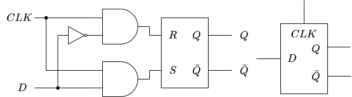

# 組み合わせ回路と順序回路
前回は、デジタル回路の基礎的な構成要素となる論理ゲートの理論と実装について学びました。
今回は、論理ゲートを組み合わせてより複雑な機能を実現する回路の構成について見ていきます。

## 組み合わせ回路 (Combination Circuit)
入力が決まると出力が一意に定まるデジタル回路のことを**組み合わせ回路**と呼びます。
前回出てきた論理ゲートは、いずれも組み合わせ回路の一種です。
ここでは、論理ゲート以外に CPU の作成において重要な組み合わせ回路をいくつか紹介します。

### 多入力論理ゲート
これまで出てきた論理ゲートは、いずれも2入力 (NOT のみ1入力) でしたが、3入力以上に拡張することもできます。
例えば、3入力の AND ゲートや OR ゲートは、2入力の AND ゲートや OR ゲートを2個組み合わせて実現できます。

    
    <figcaption>図 1. 3入力の ANDゲートと OR ゲート</figcaption>

同様に、$n$ 入力の場合は $n-1$ 個の論理ゲートを組み合わせて実現できます。
また、$n$ 入力の NAND ゲートや NOR ゲートは、$n$ 入力の AND ゲートや OR ゲートの出力を NOT ゲートで反転したものになります。

### マルチプレクサ (Multiplexer)
マルチプレクサは、2つ以上の信号を1つの信号として出力する機構のことを指します。
もともと、通信分野で2つ以上の信号を1本の信号線で送るためにシリアライズ (直列化) する装置を指していましたが、デジタル回路の分野では選択ビットで指定された入力信号 (データビット) を出力信号に渡す組み合わせ回路のことを指します。
以下に、3入力1出力のマルチプレクサの例を示します。

    
    <figcaption>図 2. マルチプレクサの回路記号</figcaption>

$SEL$ が選択ビット、$IN1$ と $IN2$ がデータビットに該当します。
$SEL$ が0の時は $IN1$ を、1の時は $IN2$ を $OUT$ に出力するので、真理値表は以下のようになります。

$$
\begin{array}{ccc||c}
IN1 & IN2 & SEL & OUT \\
\hline
0 & 0 & 0 & 0 \\
0 & 1 & 0 & 0 \\
1 & 0 & 0 & 1 \\
1 & 1 & 0 & 1 \\
0 & 0 & 1 & 0 \\
0 & 1 & 1 & 1 \\
1 & 0 & 1 & 0 \\
1 & 1 & 1 & 1 \\
\end{array}
$$

このマルチプレクサを基本論理ゲートの組み合わせで表現すると、以下の図のようになります。

    
    <figcaption>図 3. 基本論理ゲートで構成されたマルチプレクサ</figcaption>

また、NAND ゲートを4個だけ使って実装することもできます。

    
    <figcaption>図 4. NAND で構成されたマルチプレクサ</figcaption>

さらに、4入力のように多入力のマルチプレクサを作ることもできます。
ここでは4入力のマルチプレクサの例を見てみましょう。
2ビットの選択ビット $SEL[0], SEL[1]$ と4本の入力信号 $IN1, IN2, IN3, IN4$ を持つ時、出力 $OUT$ は以下のようになります。

$$
\begin{array}{cc||c}
SEL[1] & SEL[0] & OUT \\
\hline
0 & 0 & IN1 \\
0 & 1 & IN2 \\
1 & 0 & IN3 \\
1 & 1 & IN4 \\
\end{array}
$$

4入力のマルチプレクサは、2入力のマルチプレクサを3個使って次のように実装できます。

    
    <figcaption>図 5. 4入力のマルチプレクサ</figcaption>

一般に、$n$ 入力のマルチプレクサは、$log_2 n$ 本の選択ビットと $n-1$ 個の2入力マルチプレクサを使って実装できます。

### デマルチプレクサ (Demultiplexer)
マルチプレクサとは反対に、1つの入力を受け取り2つの出力のどちらに値を渡すか選択する機構をデマルチプレクサと呼びます。
回路記号と入出力の関係は以下のようになります。

$$
\begin{array}{c||cc}
SEL & OUT1 & OUT2 \\
\hline
0 & IN & 0 \\
0 & 0 & IN \\
\end{array}
$$

    
    <figcaption>図 6. デマルチプレクサ</figcaption>

デマルチプレクサも基本論理ゲートの組み合わせで実装できます。

    
    <figcaption>図 7. 基本論理ゲートで構成されたデマルチプレクサ</figcaption>

マルチプレクサと同様に多出力のデマルチプレクサを作ることもできます。

## 順序回路 (Sequential Circuit)
外部からの入力だけでなく、回路に含まれる記憶素子の状態によって出力が定まるデジタル回路を順序回路と呼びます。
ここでは、順序回路に必要なクロック信号と、ラッチやフリップフロップなどの基礎的な順序回路について見ていきます。

### クロック信号
組み合わせ回路では、入力が定まれば出力が一意に決まりますが、入力に対して出力が即座に反応するわけではありません。
MOSFET の特性から、入力の変化に対して出力が変化し始めるまでに若干の遅延が生じます。
また、0→1 や 1→0 の変化も瞬時に起きるものではなく、曲線を描いて徐々に変化していきます。
例えば、NOT ゲートの入出力は次のように変化します。

    
    <figcaption>図 8. NOT ゲートにおける入出力の遅延</figcaption>

この入出力の遅延は、論理ゲートを積み重ねるほど、すなわち回路規模が大きくなるほど累積して大きくなっていきます。
記憶素子を持つ順序回路では、この遅延が大きな問題になります。
記憶素子に状態を保存するタイミングによっては、意図しない出力状態を取り込んでしまったり、0とも1とも判別のつかない中間の状態を取り込んでしまったりする可能性があります。  
そこで、順序回路では動作のタイミングを決めるクロック信号を導入します。
クロック信号は一定の周期で0と1を繰り返す信号で、0→1→0 と変化する周期を1サイクルとします。
0→1 に変化するタイミングを立ち上がりエッジ、1→0 に変化するタイミングを立ち下がりエッジと呼び、このどちらか、または両方のタイミングで信号の状態を取得します。

    
    <figcaption>図 9. クロック信号の立ち下がりエッジで状態を取得する NOT ゲートの例</figcaption>

クロック信号はクロックオシレータと呼ばれる専用のデバイスを使って生成します。
また、クロックサイクルの長さ (サイクル長) は回路で発生しうる最大の遅延時間よりも長く設定する必要があります。
しかし、サイクル長を短くすればするほど回路の動作は早くなるため、回路の構成を俯瞰して最大遅延時間よりも少しだけ長く設定するのが最適となります。

### NOT ゲートを2個だけ用いた順序回路
2個の NOT ゲートをたすき掛けで接続することで、1ビットのデータを保持する順序回路を構築できます。

    
    <figcaption>図 10. NOT ゲートを2個だけ用いた順序回路</figcaption>

$Q$ が1の時には $\bar{Q}$ は0、$Q$ が0の時には $\bar{Q}$ は1となります。
ただし、外部から出力を変化させる入力を与えることはできず、また最初の状態は未知で予想することもできないため、電源を入れるたびに挙動が変わってしまうため、データを保持するには非常に不便です。

### SR ラッチ
あるタイミングで入力信号の論理値を取り込み、その状態を出力として保持する回路をラッチ回路と呼びます。
最も単純なラッチ回路として、SR ラッチが挙げられます。
NOR ゲートが2個たすき掛けで接続されており、出力 $Q$、$\bar{Q}$ のほか、入力として $R$ と $S$ の2つの端子を持ちます。

    
    <figcaption>図 11. SR ラッチ</figcaption>

SR ラッチの真理値表は以下のようになります。

$$
\begin{array}{cc||cc}
R & S & Q & \bar{Q} \\
\hline
0 & 0 & Q_{prev} & \bar{Q}_{prev} \\
0 & 1 & 1 & 0 \\
1 & 0 & 0 & 1 \\
1 & 1 & 0 & 0 \\
\end{array}
$$

$R=S=0$ の場合には直前の出力状態がそのまま維持されるので、1ビットのデータを保持できていることになります。
また、$R=1$、$S=0$ の場合は以前の出力によらず $Q=0$ に、$R=0$、$S=1$ の場合は以前の出力によらず $Q=1$ になります。
それぞれの状態をリセット状態、セット状態と呼びます。
すなわち、外部入力によって出力状態を変更したり保持したりできるようになっているのです。
しかし、$R=S=1$、つまりリセットとセットを同時にかけると、$Q=\bar{Q}=0$ となり $\bar{Q}$ が $Q$ の反転信号になるという前提が崩れてしまいます。
すると、次の状態を確定できなくなるため、$R=S=1$ とするのは禁止されています。  

### D ラッチ
SR ラッチは禁止状態があるため扱いにくく、また $R$ と $S$ の信号タイミングの制御もしなければなりません。
そこで、SRラッチを改良した D ラッチでは、リセット信号 $R$ とセット信号 $S$ の代わりに、クロック信号 $CLK$ とデータ信号 $D$ を入力とします。
状態の更新タイミングは $CLK$ で、保持すべきデータは $D$ で分けて制御することで、SR ラッチに比べて扱いやすくなります。
D ラッチの回路図と真理値表は以下の通りです。

    
    <figcaption>図 12. D ラッチ</figcaption>

$$
\begin{array}{cc||cc}
CLK & D & Q & \bar{Q} \\
\hline
0 & X & Q_{prev} & \bar{Q}_{prev} \\
1 & 0 & 0 & 1 \\
1 & 1 & 1 & 0 \\
\end{array}
$$

$CLK$ が0の場合、$D$ の値に関係なく $R$ と $S$ の入力値が0になるので、SR ラッチと同様、$Q$ と $\bar{Q}$ の値は保存されます。
一方、$CLK$ が1の場合には $D$ の値によって出力の値が変化します。
すなわち、クロック信号が立ち上がっている間は、状態が変化し続ける透過 (トランスペアレント) 状態になります。

### D フリップフロップ (DFF)
D ラッチはクロック信号が1の間は入力を透過してしまいますが、これを2つカスケード接続 (縦つなぎ) した D フリップフロップは、特定のタイミングでのみ入力の状態を取り込む動作を実現できます。
D フリップフロップの回路図は以下の通りです。
下図の右側2つは D フリップフロップの回路記号と簡略記号です。

    
    <figcaption>図 13. D フリップフロップ</figcaption>

Dフリップフロップの1つ目 (図左側) の D ラッチをリーダ (マスタ)、2つ目 (図右側) をフォロワ (スレーブ) と呼びます。
$CLK$ が0の時、リーダは透過状態になって D フリップフロップの入力がフォロワのデータ入力に伝播します。
その後、$CLK$ が1に切り替わったタイミングでフォロワが透過状態になるので、フォロワの入力が D フリップフロップの出力に伝播します。
しかし、それと同時にリーダの $CLK$ が0になるので、D フリップフロップの入力とフォロワの入力は切り離されます。
つまり、$CLK$ が 0→1 に立ち上がった瞬間 (立ち上がりエッジ) の $D$ の値を保持できることになります。
このような動作をする D フリップフロップを、特にポジティブエッジトリガフリップフロップと呼びます。
逆に、クロックが 1→0 に立ち下がるタイミングでデータを取り込む D フリップフロップを、ネガティブエッジトリガフリップフロップと呼びます。
