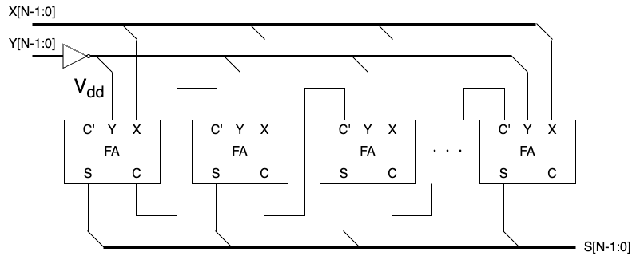

# ALU の設計 その1：加減算回路の設計
前回は、基礎的な組み合わせ回路と順序回路について学びました。
今回は、より実用的な算術演算 (加減算など) や論理演算 (AND、OR やシフトなど) を実行する回路について学んでいきます。
最終的には、ALU (Arithmetic Logic Unit: 算術演算回路) の設計を目指します。

## RISC-V RV32I の算術論理演算
RISC-V の RV32I には、次のような算術論理演算の命令が定義されています。

- 加減算：ADD、ADDI、SUB
- 論理演算：AND、ANDI、OR、ORI、XOR、XORI
- シフト演算：SLL、SLLI、SRL、SRLI、SRA、SRAI
- 大小比較：SLT、SLTI、SLTU、SLTIU

それぞれに、レジスタ値演算と "I" の付く即値演算のバリエーションはありますが、演算の内容に変わりはありません。
論理演算は論理ゲートでそのまま実装できるので、今回はまず論理演算以外の演算を実現する回路の設計について見ていきます。

## 加算器
まずは、2値の加算を行う加算器についてです。
RV32I には減算命令 $SUB$ もありますが、負の整数との加算であると考えれば加算器を使って実現できます。

### 半加算器
半加算器は、$X$ と $Y$ の2つの1ビット入力と、加算結果 (Sum) を表す $S$ と桁上がり (Carry) を表す $C$ の2つの1ビット出力を持つ回路です。
1桁の2進数の加算を計算すればよいので、真理値表は以下の通りです。

$$
\begin{array}{cc||cc}
X & Y & C & S \\
\hline
0 & 0 & 0 & 0 \\
0 & 1 & 0 & 1 \\
1 & 0 & 0 & 1 \\
1 & 1 & 1 & 0 \\
\end{array}
$$

真理値表から、$C=X\ AND\ Y$、$S=X\ XOR\ Y$ で計算できることがわかります。
よって、半加算器の回路は以下のように実装できます。

    
    <figcaption>図 1. 半加算器</figcaption>

### 全加算器
半加算器は2入力ですが、全加算器は $X$、$Y$ に加えて $C'$ の3入力で、それらの加算を行う回路です。
全加算器の入力は全て1ビットで、出力は半加算器と同じく $S$ と $C$ です。
真理値表は以下のようになります。

$$
\begin{array}{ccc||cc}
X & Y & C' & C & S \\
\hline
0 & 0 & 0 & 0 & 0 \\
0 & 0 & 1 & 0 & 1 \\
0 & 1 & 0 & 0 & 1 \\
0 & 1 & 1 & 1 & 0 \\
1 & 0 & 0 & 0 & 1 \\
1 & 0 & 1 & 1 & 0 \\
1 & 1 & 0 & 1 & 0 \\
1 & 1 & 1 & 1 & 1 \\
\end{array}
$$

一見複雑な回路になりそうですが、その名の通り半加算器を2つ組み合わせることで全加算器を作ることができます。

    
    <figcaption>図 2. 全加算器</figcaption>

### $N$ ビット加算器
半加算器も全加算器も、入出力は全て1ビットでした。
しかし、現実には16ビットや32ビットの加算ができなければなりません。
ここでは、2ビットの入力 $X[1:0]$ と $Y[1:0]$、および2ビットの出力 $S[1:0]$ を考えてみましょう。
まず、加算器の各入力の1桁目 $X[0]$、$Y[0]$ の和を計算します。
この計算は2入力なので半加算器を使います。
半加算器の出力 $S$ が加算器の1桁目の出力 $S[0]$ となり、半加算器の出力 $C$ は2桁目への桁上がりとして利用されます。
次に、加算器の各入力の2桁目 $X[1]$ と $Y[1]$ の和を計算します。
この時、1桁目の計算からの桁上がりも考慮する必要があるため、3入力の全加算器を利用します。
そして、全加算器の出力 $S$ が加算器の2桁目の出力 $S[1]$ となります。
全加算器の出力 $C$ の扱いは設計次第です。
加算器の3ビット目の出力 $S[2]$ としても良いですし、オーバフローが発生したフラグとして利用することもできます。
以上をもとに、2ビットの加算器を設計すると下図のようになります。

    
    <figcaption>図 3. 2ビットの加算器</figcaption>

これを拡張すれば、$N$ ビットのの加算器は1桁目の半加算器と、$N-1$ 個の全加算器をカスケード接続することで実装できます。
半加算器の挙動は全加算器の入力 $C'$ を0で固定 (GND に接続) すれば実現できるので、現実的には $N$ 個の全加算器を以下の図のように接続します。

    
    <figcaption>図 4. Nビットの加算器</figcaption>

### 減算器
上でも少し述べましたが、減算は2の補数表現を用いて簡単に実装できます。
$-Y = \bar{Y} + 1$ と表せるので、 $X-Y=X+\bar{Y}+1$ で計算できます。

    
    <figcaption>図 4. Nビットの減算器</figcaption>

次回は、上記の演算回路を SystemVerilog を使って実装してみます。