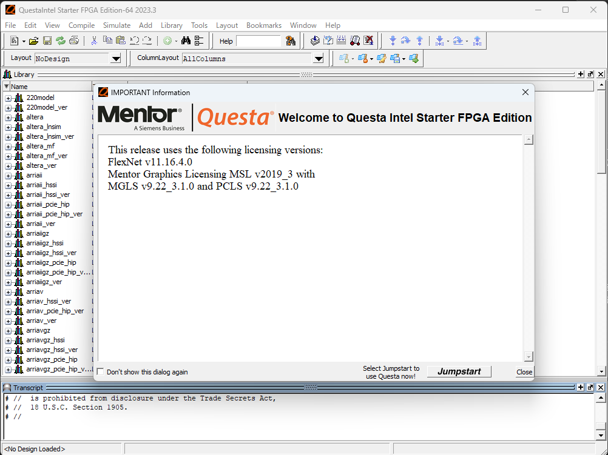
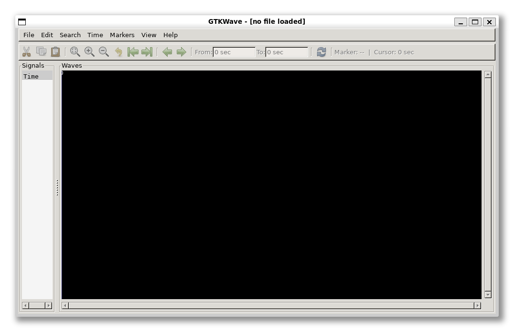

# ALU の設計 その2：半加算器の実装とテスト
前回は、算術演算の処理を行う ALU の設計の第1段階として、加減算回路の設計について学びました。
今回は、設計した回路を SystemVerilog を用いて実装してみたいと思います。

## Questa Intel FPGA Starter Edition のセットアップ
一般的に、HDL SystemVerilog で記述した回路のシミュレーションやデバッグを行うため、Quartus Prime と一緒にインストールしたQuesta を利用します。
Questa の利用には無償ですがライセンスを取得する必要があるため、[インテル FPGA & プログラマブル・デバイスのページ](https://www.intel.co.jp/content/www/jp/ja/products/programmable.html)からライセンスの発行作業を行います。
詳細な手順は、下記のマクニカのページに記載があります。

- インテルアカウントの作成  
  [https://www.macnica.co.jp/business/semiconductor/articles/intel/129997/](https://www.macnica.co.jp/business/semiconductor/articles/intel/129997/)
- インテル FPGA セルフサービス・ライセンスセンターへの新規登録  
  [https://www.macnica.co.jp/business/semiconductor/articles/intel/143425/](https://www.macnica.co.jp/business/semiconductor/articles/intel/143425/)
- ライセンスファイルの取得および設定  
  [https://www.macnica.co.jp/business/semiconductor/articles/intel/139706/](https://www.macnica.co.jp/business/semiconductor/articles/intel/139706/)

若干 UI が代わっている箇所はありますが、記載の手順通りに操作すればライセンスファイルを発行してもらえます。
ダウンロードしたライセンスのパスを環境変数 ```LM_LICENSE_FILE``` に設定し、Quartus Prime と一緒にインストールした Questa を実行すると、下記のように Questa のウィンドウが開きます。

<div align="center">
    
    <figcaption>図 1. Questa の起動画面</figcaption>
</div>

## Icarus Verilog と GTKWave の導入
オープンソースな SystemVerilog のシミュレーション環境として Icarus Verilog と波形ビューワの GTKWave も導入しておきます。
Windows 版も頒布されていますが、パスの設定などが面倒なので WSL 上に導入します。

```bash
$ sudo apt install iverilog gtkwave
```

```gtkwave``` コマンドを実行して以下のような GUI が表示されれば OK です。

<div align="center">
    
    <figcaption>図 2. GTKWave の画面</figcaption>
</div>

## 半加算器の実装
SystemVerilog の実行環境を用意できたので、実際に半加算器の回路を SystemVerilog で記述してみたいと思います。
実装する半加算器は、前回設計した AND ゲートと XOR ゲートを使った回路です。

<div align="center">
    
    <figcaption>図 1. 実装する半加算器</figcaption>
</div>

以下が SystemVerilog で実装した半加算器の記述になります。

```halfadder.sv```
```systemverilog
module halfadder(
    input  logic a, b,
    output logic s, c
);
    always_comb begin
       s = a ^ b;
       c = a & b;
    end
endmodule
```

上記では、入力信号として $a$ と $b$、出力信号として $s$ と $c$ を持つモジュール ```half_adder``` を定義しています。
```logic``` は (0, 1, x, z) のいずれかの値を取りうることを表すデータ型です。
```x``` は "Don't care" (不定値)、```z``` はハイインピーダンスを表します。
```always_comb``` は、直後の ```begin``` と ```end``` で囲まれたブロック内に組み合わせ回路が記述されていることを表すプロシージャです。
ここでは、入力信号の ```AND``` 演算と ```XOR``` 演算を計算して、出力信号に割り当てています。
信号の割り当てには、ブロッキング代入 ```=``` とノンブロッキング代入 ```<=``` がありますが、今回の例ではブロッキング代入を使っています。 
ブロッキング代入では、書かれた順番通りに代入が行われるような回路が構成されます。
ノンブロッキング代入を使うと、組み合わせ回路内に意図せずラッチが生成されてしまう場合があるため、```always_comb``` 内では基本的にブロッキング代入を利用します。

## テストベンチの記述
上記で実装した半加算器が想定通りの動作をするか、テストベンチを書いて確かめます。
以下がテストベンチの記述になります。

```test_halfadder.sv```
```systemverilog
`include "halfadder.sv"

module test_halfadder();
    logic a, b; // 入力信号
    logic s, c; // 出力信号

    // 半加算器のインスタンスを作成
    halfadder _halfadder (
        .a(a),
        .b(b),
        .s(s),
        .c(c)
    );

    initial begin
        $display("a b || s c");
        $display("----++----");

        // テストパターンを試す
        a = 0; b = 0; #10; $display("%d %d || %d %d", a, b, s, c);
        a = 0; b = 1; #10; $display("%d %d || %d %d", a, b, s, c);
        a = 1; b = 0; #10; $display("%d %d || %d %d", a, b, s, c);
        a = 1; b = 1; #10; $display("%d %d || %d %d", a, b, s, c);
    end
endmodule
```

1行目で ```halfadder``` モジュールを実装したファイルをインポートしています。
3行目以降がテストベンチ本体のモジュールとなっていますが、このモジュールは入出力信号を持ちません。
代わりに、内部信号として半加算器と同じく $a$、$b$、$s$、$c$ の4本の信号線を持ちます。
そして、先ほど実装した半加算器のインスタンスを作成します。
この時、```test_halfadder``` モジュールの内部信号 $a$、$b$、$s$、$c$ と、半加算器 ```halfadder``` モジュールの入出力信号 $a$、$b$、$s$、$c$ とを接続します。
最後に、```initial``` の中で入力信号を変化させて出力信号が期待通りになるかを確認します。
ここでは、入出力のパターンが少ないので、全て列挙して結果を表示させて確認する方法を取っています。
```$display``` で表示させる以外にも、ファイルにテストパターンを記述しておいて出力結果をファイルに書き出して確認することもできますが、ここでは省略します。  
ここでは、簡単に Icarus Verilog でコンパイルしてテストベンチを実行してみます。

```bash
# コンパイル
$ iverilog -g 2012 -o test_halfadder test_halfadder.sv

# テストベンチの実行
$ vvp test_halfadder
a b || s c
----++----
0 0 || 0 0
0 1 || 1 0
1 0 || 1 0
1 1 || 0 1
```

ちゃんと期待通りの出力が得られていることが確認できました。
個人的には、インスタンスの入力に接続された信号 $a$、$b$ の値を変化させると、出力に接続された信号 $s$、$c$ が変化するというのが、なんとなく気持ち悪い気がしてしまいます。
普段は Python ばかり書いていて、インスタンスを生成しても、明示的なメソッドの呼び出しや変数の更新がなければ、内部の状態や出力が変化しないので、自分の直感からはちょっとズレた挙動に感じます。