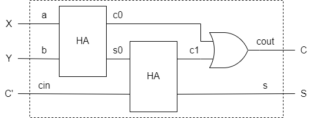

# ALU の設計 その 3：全加算器や加算器の実装

前回は、半加算器を SystemVerilog で実装して、テストベンチで動作確認を行いました。
今回は、これをベースに全加算器や多ビットの加算器を実装していきます。

## 全加算器の実装

全加算器は半加算器 2 つと OR ゲートを利用して実装できます。
ただ、半加算器が 2 つあると信号線の名前がかぶってしまうので、図 1 のように信号線の名前を付けなおします。

<div align="center">
    
    <figcaption>図 1. 全加算器の信号名</figcaption>
</div>

これを SystemVerilog に起こすと以下のような記述になります。

`fulladder.sv`

```systemverilog
`include "halfadder.sv"

module fulladder(
    input  logic a, b, cin,
    output logic s, cout
);
    // 内部信号の宣言
    logic s0, c0, c1;
    // 1段目の半加算器のインスタンスを生成
    halfadder ha0(.a(a), .b(b), .s(s0), .c(c0));
    // 2段目の半加算器のインスタンスを生成
    halfadder ha1(.a(s0), .b(cin), .s(s), .c(c1));

    always_comb begin
        cout = c0 | c1;
    end
endmodule
```

まず、半加算器の実装がもとになるので `halfadder.sv` を読み込んでおきます。
モジュールの入出力信号の宣言は半加算器の場合と同様です。
全加算器ではモジュールの入出力以外に、2 つの半加算器や OR ゲートの間をつなぐために内部信号が必要となるので、`s0`、`c0`、`c1` の 3 本の内部信号を宣言しておきます。
全加算器の 1 段目の半加算器を `ha0`、2 段目の半加算器を `ha1` としてインスタンス化します。
それぞれ、入出力信号を接続してあるので、全加算器の入力を変化させれば出力 `s` は定まります。
ただ、`cout` は内部信号 `c0` と `c1` の OR を取らなければならないので、`always_comb` ブロックの中で `cout` を計算します。  
全加算器が実装できたので、全加算器のテストベンチを書きます。
基本的には半加算器の場合と同様で、入力のパターンを列記して出力状態を目視で確認します。

`test_fulladder.sv`

```systemverilog
`include "fulladder.sv"

module test_halfadder();
    logic a, b, cin; // 入力信号
    logic s, cout;   // 出力信号

    // 半加算器のインスタンスを作成
    fulladder _fulladder (.a(a), .b(b), .cin(cin), .s(s), .cout(cout));

    initial begin
        $display("a b cin || s cout");
        $display("--------++-------");

        // テストパターンを試す
        a = 0; b = 0; cin = 0; #10; $display("%d %d  %d  || %d  %d", a, b, cin, s, cout);
        a = 0; b = 0; cin = 1; #10; $display("%d %d  %d  || %d  %d", a, b, cin, s, cout);
        a = 0; b = 1; cin = 0; #10; $display("%d %d  %d  || %d  %d", a, b, cin, s, cout);
        a = 0; b = 1; cin = 1; #10; $display("%d %d  %d  || %d  %d", a, b, cin, s, cout);
        a = 1; b = 0; cin = 0; #10; $display("%d %d  %d  || %d  %d", a, b, cin, s, cout);
        a = 1; b = 0; cin = 1; #10; $display("%d %d  %d  || %d  %d", a, b, cin, s, cout);
        a = 1; b = 1; cin = 0; #10; $display("%d %d  %d  || %d  %d", a, b, cin, s, cout);
        a = 1; b = 1; cin = 1; #10; $display("%d %d  %d  || %d  %d", a, b, cin, s, cout);
    end
endmodule
```

コマンドを実行して動作を確認しましょう。
うまく動いていそうです。

```bash
$ iverilog -g 2012 -o test_fulladder test_fulladder.sv
$ vvp test_fulladder
a b cin || s cout
--------++-------
0 0  0  || 0  0
0 0  1  || 1  0
0 1  0  || 1  0
0 1  1  || 0  1
1 0  0  || 1  0
1 0  1  || 0  1
1 1  0  || 0  1
1 1  1  || 1  1
```

## 多ビット加算器

多ビットの加算器は全加算機を数珠繋ぎにして実装できます。
SystemVerilog の記述は以下の通りです。

```adder.sv```
```systemverilog
`include "fulladder.sv"

module adder
    #(parameter nbit = 32)
    (
        input  logic [(nbit - 1):0] a, b,
        output logic [(nbit - 1):0] s,
        output logic cout
    );
    // 各全加算機の出力信号
    logic [(nbit - 1):0] fa_cout;

    // nbit 個の加算器を接続
    genvar i;
    generate
        for (i = 0; i < nbit; i++) begin : genAdder
            fulladder fa(
                .a(a[i]), .b(b[i]), .cin(i==0?1'b0:fa_cout[i-1]), 
                .s(s[i]), .cout(fa_cout[i])
            );
        end
        assign cout = fa_cout[nbit - 1];
    endgenerate
endmodule
```

```#(parameter nbit = 32;)``` で加算器のビット数を指定しています。
また、入出力も多ビットになるので、```[(nbit - 1):0]``` のように信号線のビット数を指定します。
そして、```generate ... endgenerate``` ブロックの中で ```for``` 文を呼び出して、パラメータ ```nbit``` で指定された個数の全加算器を接続します。
```generate``` 文は ```module``` などのインスタンス化制御を行うための構文で、```for``` 文以外にも、```if``` 文や ```case``` 文も使えます。
```for``` 文の ```begin``` の後に ```genAdder``` というラベルを付けています。
ラベルはインスタンスのスコープ制御において重要となるので、忘れずにつけるようにしましょう。
```i==0?1'b0:fa_cout[i-1]``` は三項演算子で、```i==0``` の場合、すなわち最初の全加算器の時は、入力 ```cin``` を常に 0 にセットし、それ以外の場合には、１つ前の全加算器の桁上がり出力 ```fa_cout[i - 1]``` を接続することを表しています。   
さて、テストベンチを書いて動作確認をしようと思いますが、デフォルトの32ビット加算器のテストパターンを作るのは大変です。
ここでは、一旦2ビット加算器としてインスタンスを作成し、下記の真理値表の通り、16通りの入力パターンで出力が一致するかどうかを確認してみます。
(入力パターンの対称性を考えれば、半分の8パターンで十分だとは思いますが…)

$$
\begin{array}{cc||cc}
a[1:0] & b[1:0] & cout & s[1:0] \\
\hline
00 & 00 & 0 & 00 \\
00 & 01 & 0 & 01 \\
00 & 10 & 0 & 10 \\
00 & 11 & 0 & 11 \\
01 & 00 & 0 & 01 \\
01 & 01 & 0 & 10 \\
01 & 10 & 0 & 11 \\
01 & 11 & 1 & 00 \\
10 & 00 & 0 & 10 \\
10 & 01 & 0 & 11 \\
10 & 10 & 1 & 00 \\
10 & 11 & 1 & 01 \\
11 & 00 & 0 & 11 \\
11 & 01 & 1 & 00 \\
11 & 10 & 1 & 01 \\
11 & 11 & 1 & 10 \\
\end{array}
$$

テストベンチの記述は以下の通りです。

```test_adder.sv```
```systemverilog
`include "adder.sv"

module test_halfadder();
    logic [1:0] a, b;
    logic [1:0] s;
    logic       cout;

    // 2ビット加算器のインスタンスを作成
    adder #(.nbit(2)) _adder (.a(a), .b(b), .s(s), .cout(cout));

    initial begin
        $display("a[1:0] b[1:0] || cout s[1:0]");
        $display("--------------++------------");

        // テストパターンを試す
        a = 2'b00; b = 2'b00; #10; $display("  %b     %b   ||  %b     %b", a, b, cout, s);
        a = 2'b00; b = 2'b01; #10; $display("  %b     %b   ||  %b     %b", a, b, cout, s);
        a = 2'b00; b = 2'b10; #10; $display("  %b     %b   ||  %b     %b", a, b, cout, s);
        a = 2'b00; b = 2'b11; #10; $display("  %b     %b   ||  %b     %b", a, b, cout, s);
        a = 2'b01; b = 2'b00; #10; $display("  %b     %b   ||  %b     %b", a, b, cout, s);
        a = 2'b01; b = 2'b01; #10; $display("  %b     %b   ||  %b     %b", a, b, cout, s);
        a = 2'b01; b = 2'b10; #10; $display("  %b     %b   ||  %b     %b", a, b, cout, s);
        a = 2'b01; b = 2'b11; #10; $display("  %b     %b   ||  %b     %b", a, b, cout, s);
        a = 2'b10; b = 2'b00; #10; $display("  %b     %b   ||  %b     %b", a, b, cout, s);
        a = 2'b10; b = 2'b01; #10; $display("  %b     %b   ||  %b     %b", a, b, cout, s);
        a = 2'b10; b = 2'b10; #10; $display("  %b     %b   ||  %b     %b", a, b, cout, s);
        a = 2'b10; b = 2'b11; #10; $display("  %b     %b   ||  %b     %b", a, b, cout, s);
        a = 2'b11; b = 2'b00; #10; $display("  %b     %b   ||  %b     %b", a, b, cout, s);
        a = 2'b11; b = 2'b01; #10; $display("  %b     %b   ||  %b     %b", a, b, cout, s);
        a = 2'b11; b = 2'b10; #10; $display("  %b     %b   ||  %b     %b", a, b, cout, s);
        a = 2'b11; b = 2'b11; #10; $display("  %b     %b   ||  %b     %b", a, b, cout, s);
    end
endmodule
```

期待通りの結果が得られました。

```bash
$ iverilog -g 2012 -o test_adder test_adder.sv
$ vvp test_adder
a[1:0] b[1:0] || cout s[1:0]
--------------++------------
  00     00   ||  0     00
  00     01   ||  0     01
  00     10   ||  0     10
  00     11   ||  0     11
  01     00   ||  0     01
  01     01   ||  0     10
  01     10   ||  0     11
  01     11   ||  1     00
  10     00   ||  0     10
  10     01   ||  0     11
  10     10   ||  1     00
  10     11   ||  1     01
  11     00   ||  0     11
  11     01   ||  1     00
  11     10   ||  1     01
  11     11   ||  1     10
```

## 減算器の実装
最後に、減算器の実装を見ていきましょう。
と言っても、加算器とさほど変わらないので実装のみを示します。

```suber.sv```
```systemverilog
`include "fulladder.sv"

module suber
    #(parameter nbit = 32)
    (
        input  logic [(nbit - 1):0] a, b,
        output logic [(nbit - 1):0] s
    );
    // 各全加算機の出力信号
    logic [(nbit - 1):0] fa_cout;

    // nbit 個の加算器を接続
    genvar i;
    generate
        for (i = 0; i < nbit; i++) begin : genAdder
            fulladder fa(
                .a(a[i]), .b(~b[i]), .cin(i==0?1'b1:fa_cout[i-1]), 
                .s(s[i]), .cout(fa_cout[i])
            );
        end
    endgenerate
endmodule
```

出力信号に ```cout``` はありません。
また、引く方の入力 ```b``` を反転して全加算器に入力しています。
そして、最初の全加算器の桁上げ入力には、常に1が渡されるようになっています。