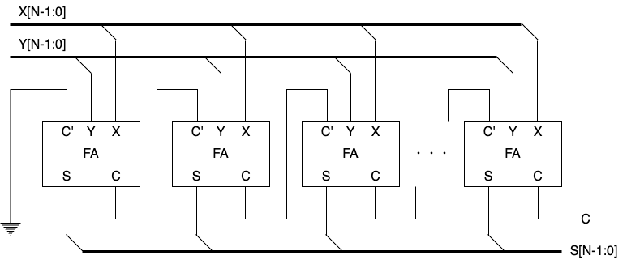
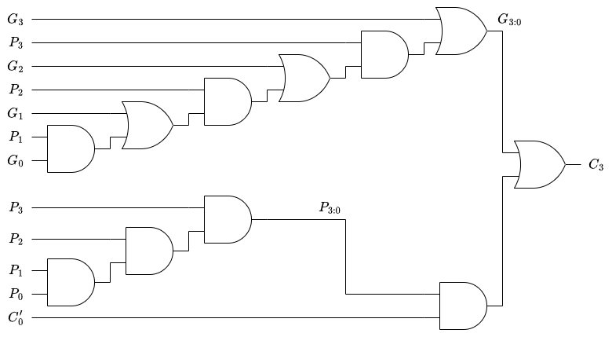

# ALU の設計 その 4：加算器の高速化
前回までは、半加算器や全加算器の実装を行い、それらをもとに多ビットの加算器や減算器を実装しました。
しかし、これらをそのまま CPU の実装で利用することはほとんどありません。
今回は、より高速に算術演算を実行可能な加算器について見ていきます。

## 順次桁上げ加算器
前回実装した $N$ 個の全加算器を数珠繋ぎにした加算器を、順次桁上げ加算器 (Ripple-Carry Adder) と呼びます。
既存のモジュールだけを繰り返し用いて演算のビット数をスケールアップできるのは大きな利点です。
しかし、加算器を1つずつ順番に処理していくので、回路の遅延がその分蓄積していきます。
特に $N$ が大きいときには遅延も大きくなり、回路設計において大きなデメリットになります。
具体的な遅延時間は、全加算器1つの出力遅延を $t_{FA}$ とすると $Nt_{FA}$ となります。

<div align="center">
    
    <figcaption>図 1. Nビットの順次桁上げ加算器</figcaption>
</div>

## 桁上げ先見加算器
桁上げ先見加算器 (Carry-Lookahead Adder: CLA) は、$N$ 個の全加算器をブロックに分割し、ブロックごとに桁上げの発生が判明した場合に、次のブロックに桁上げを通知する機能を持っています。
例えば、4ビット加算器を1ブロックとして32ビットの CPA を構築すると、以下の図のようになります。

<div align="center">
    
    <figcaption>図 2. 4ビット加算器を1ブロックとする32ビットの桁上げ先見加算器</figcaption>
</div>

桁上げ先見加算器は、各ブロック内に生成信号 $G$ と伝播信号 $P$ を持ちます。
ある桁の全加算器が桁上げ入力 $C'$ とは無関係に桁上げを出力する場合、すなわち全加算器の入力 $X$、$Y$ がともに1の場合に $C$ が１となり、これを桁上げを「生成する」と言います。
つまり、ある桁の生成信号 $G$ は $G=XY$ で決定されます。
また、ある桁の桁上げ入力 $C'$ が1の場合、全加算器の入力 $X$、$Y$ のいずれか、あるいは両方が1であれば桁上げ出力 $C$ は1となり、これを桁上げを「伝播する」と呼びます。
生成信号と同様に、ある桁の伝播信号 $P$ は $P = X + Y$ で決定されます。
生成信号 $G$ と伝播信号 $P$ のどちらか、あるいは両方が1の時、桁上げ出力 $C$ が1になるので、ある桁の桁上がり信号は以下の式の通り表されます。

$$
C = G + PC' =  XY + (X + Y) C' 
$$

これを回路図におこすと以下の通りになります。(1ビットの加算器で $C$ を $G$ と $P$ から生成するのは無意味なので、その部分は省いています。)

<div align="center">
    
    <figcaption>図 3. 生成信号 G と伝播信号 P を持つ1ビット加算器</figcaption>
</div>

次に、2ビット加算器を1ブロックとして、ブロックの桁上げ出力を計算する方法を考えましょう。
$i$ 桁目の入出力信号を $X_i$、$Y_i$、生成、伝播信号を $G_i$、$P_i$ とします。
また、$i$ 桁目から $j$ 桁目までの生成信号と伝播信号を $G_{i:j}$、$P_{i:j}$ とします。  
2ビット加算器の生成信号 $G_{1:0}$ が1となる条件は、0桁目の全加算器への桁上げ入力とは無関係に桁上げが発生する条件と等しいので、

- 0桁目の加算器が桁上がりを生成し、それを1桁目の加算器が伝播する
- 1桁目の加算器が桁上がりを生成する

の2通りが考えられます。
よって、生成信号 $G_{1:0}$ は $G_{1:0} = G_1 + P_1 G_0$ と表現できます。
一方、2ビット加算器の生成信号 $P_{1:0}$ が1となる条件は、0桁目の全加算器への桁上げ入力が1の場合に桁上げが発生する条件と等しいので、「0桁目、1桁目の加算器がともに入力の桁上げを伝播すること」になります。
つまり、生成信号 $P_{1:0}$ は $P_{1:0} = P_1 P_0$ と表されます。
これを帰納的に4ビット加算器まで拡張すると、以下の式が得られます。

$$
G_{3:0} = G_3 + P_3(G_2 + P_2(G_1 + P_1 G_0)) \\
P_{3:0} = P_3 P_2 P_1 P_0 \\
C_3 = G_{3:0} + P_{3:0} C'_0
$$

このことから、4ビット加算器を1ブロックとしたときの桁上げ出力 $C_3$ を求める回路は図4のようになります。

<div align="center">
    
    <figcaption>図 4. 4ビット加算器ブロックの桁上げ出力回路</figcaption>
</div>

最後に、加算器のビット数を $N$、1ブロックのビット数を $k$ として、桁上げ先見加算器の出力遅延時間 $t_{CLA}$ を求めてみましょう。
加算処理が完了するまでの流れは以下の通りです。

1. 並列に各桁の全加算器の入力 $X_i$、$Y_i$ から、桁上げの生成、伝播信号 $G_i$、$P_i$ を計算する ($t_{pg}$)
2. 並列に各ブロック内の $G_{k:0}$ と $P_{k:0}$ を計算する ($t_{pg\_block}$)
3. ブロックごと順番に $G_{k:0} + P_{k:0} C'_0$ を計算する ($(N / k -1) t_{AND\_OR}$)
4. 各ブロックの $k$ ビット加算を計算して、計算結果を出力する ($k t_{FA}$)

よって、桁上げ先見加算器の出力遅延時間は上記の和として、以下のように表されます。

$$
t_{CLA} = t_{pg} + t_{pg\_block} + (N / k -1) t_{AND\_OR} + k t_{FA}
$$

通常、$N$ は32や64、128であり、$k$ は4が採用されます。
順次桁上げ加算器では回路の出力遅延時間は $N t_{FA}$ なので、桁上げ先見加算器の出力遅延はかなり短くなります。

## プリフィックス加算器
プリフィックス加算器は、桁上げ先見加算器の生成と伝播の論理を拡張し、各桁の桁上がり入力 $C_{i-1}$ を先に計算しておき、各桁の出力 $S_i$を以下の式で求める加算器です。

$$
S_i = (X_i \oplus Y_i) \oplus C_{i-1}
$$

まず、$i=-1$ 桁目の生成信号を $G_{-1}=C_{in}$、伝播信号を $P_{-1}=0$ とします。
すると、$P_{0:-1} = P_0 P_{-1} = 0$ となるので、$C_{0} = G_{0:-1} + P_{0:-1} C_{-1} = G_{0:-1}$ となります。
よって、帰納的に $i$ 桁目の桁上げ出力 $C_i = G_{i:0}$ となります。
このことから、上式は次のように書き換え可能です。

$$
S_i = (X_i \oplus Y_i) \oplus G_{i-1:-1}
$$

次に、$i$ 桁目から $j$ 桁目をブロックとした場合の生成信号 $G_{i:j}$ を上位部分と下位部分に分けて計算する方法を考えます。
$j$ 桁目から $i$ 桁目の間で、任意の $k$ 桁目 ($i > k > j$) で上位と下位に分けるとします。
この時、$G_{i:j}$ が1となるのは、以下の2通りが考えられます。

- 上位の $k$ 桁目から $i$ 桁目で桁上がりが生成される ($G_{i:k} = 1$)
- 下位の $j$ 桁目から $k - 1$ 桁目で桁上がりが生成され、上位側で伝播される ($P_{i:k} G_{k-1:j} = 1$)

また、同様に伝播信号 $P_{i:j}$ が1となるのは、下位桁で伝播された桁上がりを上位桁でも伝播する場合に限ります。
よって、生成信号 $G_{i:j}$ と伝播信号 $P_{i:j}$ は以下のように表せます。

$$
G_{i:j} = G_{i:k} + P_{i:k} G_{k-1:j} \\
P_{i:j} = P_{i:k} P_{k-1:j}
$$

最後に、$j=-1$ として $G_{i:-1}$ を以下の流れで計算します。

1. 入力の各桁で生成、伝播信号を計算する  
   $G_0, G_1, \cdots, G_{N-2}$ と $P_0, P_1, \cdots, P_{N-2}$ を得る (ただし、$G_{-1}=C_{in}$、$P_{-1} = 0$)
2. 隣り合う2つの入力をブロックとして、ブロックの生成、伝播信号を計算する  
   $G_{i:i-1} = G_{i:i} + P_{i:i} G_{i-1:i-1} = G_i + P_i G_{i-1}$  
   $P_{i:i-1} = P_i P_{i-1}$
3. 隣り合う2つのブロックをまとめて新たなブロックとして、そのブロックの生成、伝播信号を計算する  
   $G_{i:i-3} = G_{i:i-1} + P_{i:i-1} G_{i-2:i-3}$  
   $P_{i:i-3} = P_{i:i-1} P_{i-2:i-3}$
4. 3 を $log_2 N$ 回繰り返して $G_{i-1:-1}$ を求める

この方法で設計された16ビットプリフィックス加算器を図5に示します。

<div align="center">
    
    <figcaption>図 5. 16ビットプリフィックス加算器 (「ディジタル回路設計とコンピュータアーキテクチャ RISC-V版」より)</figcaption>
</div>

この回路の出力遅延時間 $t_{PA}$ は、黒いプリフィックスセルの遅延を $t_{pg\_prefix}$ とすると以下の式で表されます。

$$
t_{PA} = t_{pg} + t_{pg\_prefix} \log_2 N + t_{XOR}
$$

プリフィックス加算器は、ビット数に対して遅延が対数スケールになるので非常に高速です。
その代わり、回路規模が大きくなるというデメリットがあります。

## HDL における加算器の選択
今回は、すべての回路要素を論理ゲートで1から作ろうと考えています。
しかし、一般的に HDL で加算器を実装するには ```+``` 演算子を利用します。
```+``` 演算子を使った場合には、速度性能の要求を満たす回路の中から、最も実装面積の小さな設計が選択されます。
