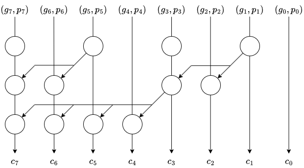
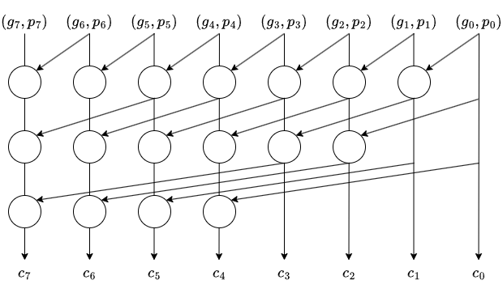
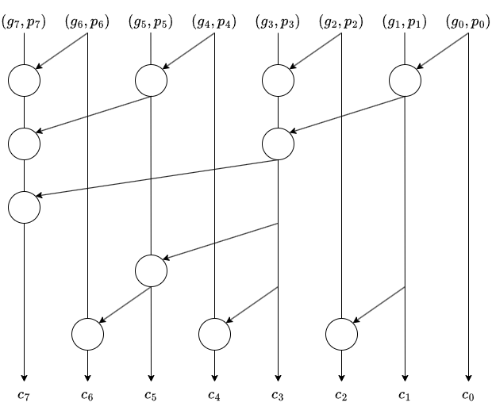
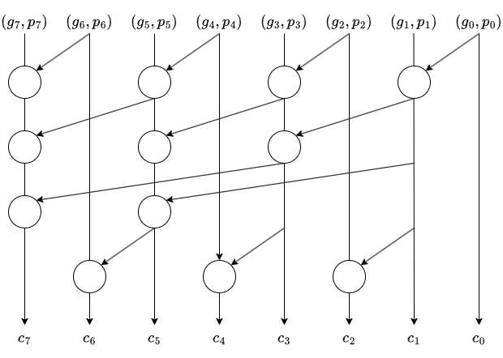

# ALU の設計 その 6：プリフィックス加算器のバリエーションと実装

今回は、プリフィックス加算器の実装について見ていきます。
ただ、以前紹介したプリフィックス加算器以外にもいくつかバリエーションがあるため、そちらを含めて紹介します。

## プリフィックス加算器のバリエーション

プリフィックス加算器は並列に桁上がりを伝播して高速に加算処理を行う加算器の総称で、Sklasky Adder をはじめ多くの種類が提案されています。

### Sklasky Adder

Sklansky Adder は 1960 年に発表された加算器です。
「ディジタル回路設計とコンピュータアーキテクチャ RISC-V 版」には Sklansky の名前は載っていませんが、前回紹介したプリフィックス加算器はこれにあたると思われます。
$N$ ビットの Sklasky Adder は $log_2 N$ 段のプリフィックスツリーを持ちます。
8 ビットの Sklasky Adder 回路図は以下の通りです。

<div align="center">
    
    <figcaption>図 1. 8ビットの Sklasky Adder</figcaption>
</div>

プリフィックスツリーの段数はプリフィックス加算器の中でも最小となりますが、1 本の信号線から分配する信号線の数が多くなってしまうという欠点があります。
1 本の信号線から複数の信号線に出力を配分することをファンアウト (fan-out) と呼びます。
Sklasky Adder は最大でファンアウトが $2^{N-1}$ 本となります。
しかし、CMOS ではファンアウトが多くなると出力ゲートにつながる負荷容量が大きくなるため、0⇔1 の遷移時間が長くなり伝播遅延が増大するという問題が生じます。

### Kogge-Stone Adder

Sklansky Adder において、入力ビット数が大きくなるとファンアウトが多くなってしまう問題に対して、1973 年に Kogge と Stone によって提案されたのが Kogge-Stone Adder です。
8 ビットの Kogge-Stone Adder の回路図は以下の通りです。

<div align="center">
    
    <figcaption>図 2. 8ビットの Kogge-Stone Adder</figcaption>
</div>

Sklasky Adder とプリフィックスツリーの段数は同じですが、桁上げ演算ブロックの数を増やし、ファンアウトの数を 2 に抑えています。
ただし、桁上げ演算ブロック数や配線数が大幅に増えるため、小型の FPGA や汎用 IC を用いた実装には向かないという欠点があります。

### Brent-Kung Adder

Brent-Kung Adder は 1982 年に発表された加算器で、配線量を最小限に抑えることができる加算器です。
8 ビットの Brent-Kung Adder の回路図は以下の通りです。

<div align="center">
    
    <figcaption>図 3. 8ビットの Brent-Kung Adder</figcaption>
</div>

配線量が最小となる代わりにプリフィックスツリーの段数は多くなるので、処理の遅延は大きくなります。
そのため、リソースの非常に限られた小型の FPGA などに適しています。

### Han-Carlson Adder

Han-Carlson Adder は Kogge-Stone Adder と Brent-Kung Adder の中間のような加算器です。
プリフィックスツリーの最初と最後は Brent-Kung Adder、中間は Kogge-Stone Adder と同じ構造を採用しています。
8 ビットの Kogge-Stone Adder の回路図は以下の通りです。

<div align="center">
    
    <figcaption>図 4. 8ビットの Han-Carlson Adder</figcaption>
</div>

Kogge-Stone Adder ほどの高速性はありませんが、必要な論理ゲート数も配線量も抑制しながら、ある程度高速な処理が可能です。
今回は、Han-Carlson Adder を実装してみようと思います。

## Han-Carlson Adder の実装

### 具体的な処理内容の書き下し

実装に先立って、具体的な処理を Python 風に書いてみます。
Han-Carlson Adder のプリフィックスツリーの段数は、入力 $N$ ビットに対して $\log_2 N +1$ 段になります。
まず最初に、$(\log_2 N +1)\times N$ の 2 次元配列 `gens` と `props` を準備しておきます。
また、プリフィックスツリーのインデックスを $k=0, \cdots, \log_2 N$ とします。
`prefix_cell` をプリフィックスセルの演算を行う関数であるとして、1 段目 ($k = 0$) では以下の処理を行います。

```python
for i in range(N):
    if i % 2 == 1:
        gens[k][i], props[k][i] = prefix_cell(g[i], p[i], g[i - 1], p[i - 1])
    else:
        gens[k][i] = g[i]
        props[k][i] = p[i]
```

次に、2 段目から $\log_2 N$ 段目 ($k=1, \cdots, \log_2 N - 1$) については、$k$ 段目の処理を以下の通り行います。

```python
for i in range(N):
    if i > 2 ** k and i % 2 == 1:
        gens[k][i], props[k][i] = prefix_cell(
            gens[k - 1][i], props[k - 1][i],
            gens[k - 1][i - 2 ** k], props[k - 1][i - 2 ** k])
    else:
        gens[k][i] = g[k - 1][i]
        props[k][i] = p[k - 1][i]
```

最後に、$\log_2 N + 1$ 段目 ($k=log_2 N$) は以下の通りになります。

```python
for i in range(N):
    if i > 1 and i % 2 == 0:
        gens[k][i], props[k][i] = prefix_cell(
            gens[k - 1][i], props[k - 1][i],
            gens[k - 1][i - 1], props[k - 1][i - 1])
    else:
        gens[k][i] = g[k - 1][i]
        props[k][i] = p[k - 1][i]
```

### SystemVerilog のコード
