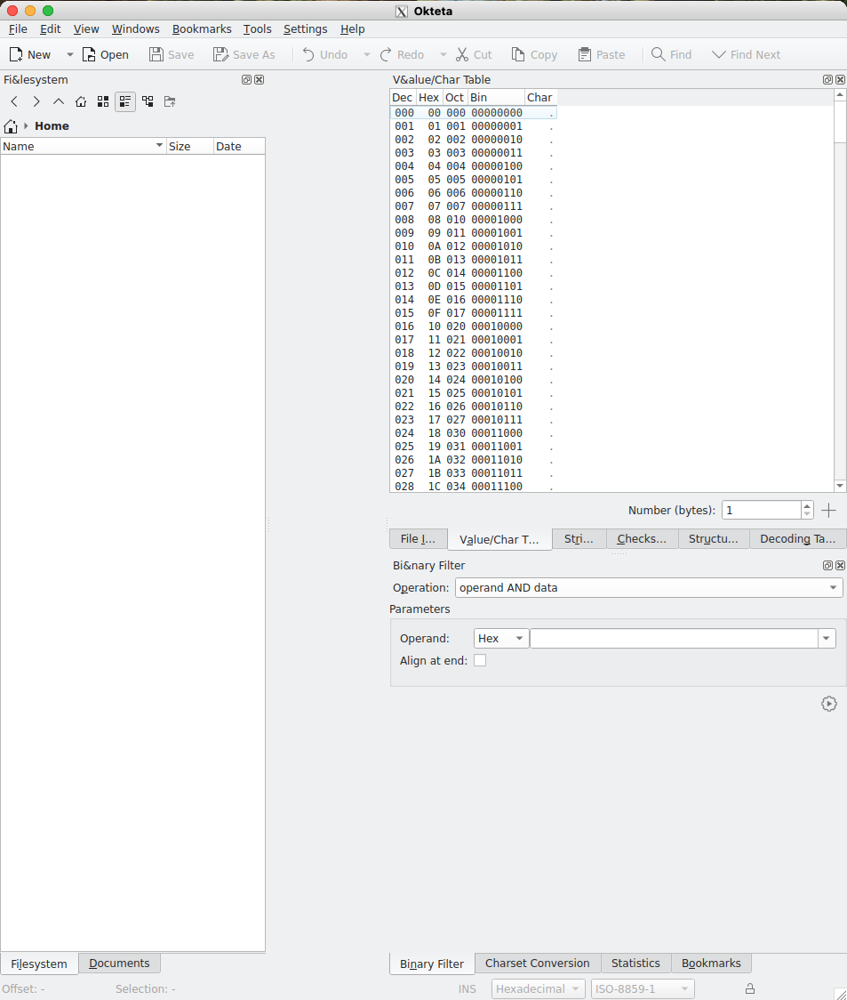

# MikanOS の開発環境の構築
「ゼロからの OS 自作入門」では、x64 の CPU か QEMU 上で MikanOS を動かすことを想定していますが、普段使っているのは MacBook Air (M4) なので、Docker で QEMU を使った環境構築します。

## XQuartz のインストール
MikanOS には X11 Window System を使って接続します。
Mac 向けには [XQuartz](https://www.xquartz.org/) というプロジェクトでアプリケーションが提供されています。
ホームページから pkg ファイルをダウンロードしてもインストールできますが、ここでは ```brew``` コマンドでインストールしておきます。

```bash
$ brew install --cask xquartz
```

XQuartz のシステム環境設定を開き、「セキュリティ」タブの「ネットワーク・クライアントからの接続を許可」にチェックを入れておきます。

## Dockerfile の作成
[Ubuntu 24.04 のイメージ](https://hub.docker.com/_/ubuntu)をベースに必要なパッケージをインストールしてイメージを作成します。
[こちらの Qiita の記事](https://qiita.com/yuri_cxx/items/a65481751e873245c202) を参考にさせていただきました。

```mikanos_cpp/Dockerfile```
```dockerfile
FROM ubuntu:24.04

ENV DEBIAN_FRONTEND=noninteractive

RUN apt-get update && apt-get install -y software-properties-common locales && locale-gen en_US.UTF-8 && \
    apt-get update && apt-get install -y okteta kde-plasma-desktop dbus-x11 --no-install-recommends && \
    apt-get install -y clang lldb lld llvm && \
    apt-get install -y qemu-system-x86 qemu-user qemu-user-static qemu-utils build-essential git wget curl \
    unzip ca-certificates libglib2.0-dev libfdt-dev libpixman-1-dev zlib1g-dev && \
    apt-get clean && rm -rf /var/lib/apt/lists/*
```

## docker-compose.yml の作成
```docker run``` コマンドを叩いてコンテナを起動しても良いのですが、ボリュームのマウントなども設定しておきたいので、docker-compose.yml を作成しておきます。

```docker-compose.yml```
```yml
services:
  mikanos_cpp:
    build:
      context: .
      dockerfile: ./mikanos_cpp/Dockerfile
    container_name: mikanos_cpp_container
    environment:
      - TZ=Asia/Tokyo
      - DISPLAY=host.docker.internal:0
    tty: true
    privileged: true
    volumes:
      - ./mikanos_cpp:/app
    working_dir: /app
```

## コンテナの起動と動作確認
```docker compose up``` コマンドでコンテナを立ち上げます。
その後、コンテナ内で ```okteta``` コマンドでバイナリエディタを立ち上げます。
X11 Window で以下のようなエディタが立ち上がれば成功です。

<div align="center">
    
    <figcaption>図 1. Okteta のウィンドウが開くことを確認</figcaption>
</div>