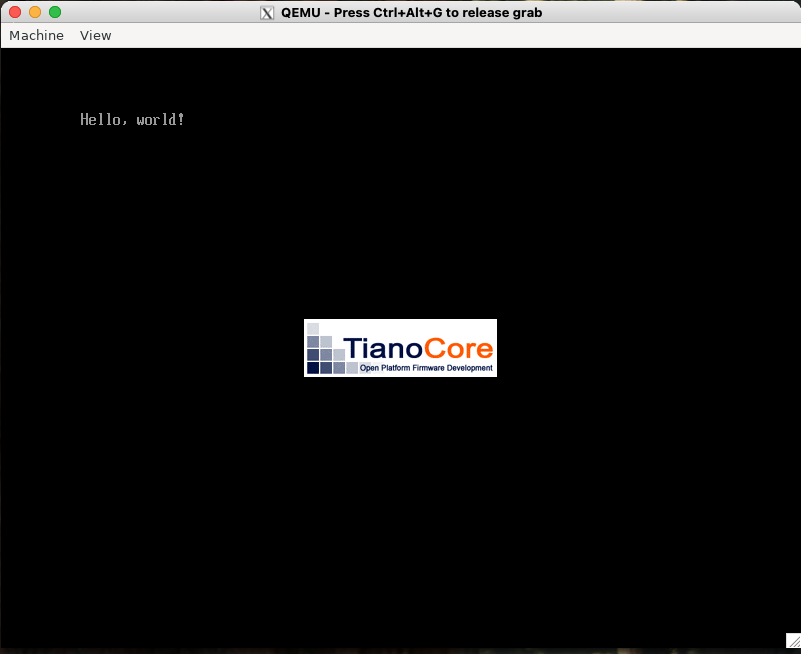

# QEMU で Hello World
今回は、前回作成した QEMU の使えるコンテナ上で、"Hello World!" を表示してみます。

## バイナリファイルの準備
まずは、Okteta で ```BOOTX64.EFI``` という名前のファイルを開き、"Hello World!" を表示させるバイナリコードを作成します。

```hello_world/BOOTX64.EFI```
```binary
00000000 4d 5a 00 00 00 00 00 00 00 00 00 00 00 00 00 00 |MZ..............|
*
00000030 00 00 00 00 00 00 00 00 00 00 00 00 80 00 00 00 |................|
*
00000080 50 45 00 00 64 86 02 00 00 00 00 00 00 00 00 00 |PE..d...........|
00000090 00 00 00 00 f0 00 22 02 0b 02 00 00 00 02 00 00 |......".........|
000000a0 00 02 00 00 00 00 00 00 00 10 00 00 00 10 00 00 |................|
000000b0 00 00 00 40 01 00 00 00 00 10 00 00 00 02 00 00 |...@............|
000000c0 00 00 00 00 00 00 00 00 06 00 00 00 00 00 00 00 |................|
000000d0 00 30 00 00 00 02 00 00 00 00 00 00 0a 00 60 81 |.0............`.|
000000e0 00 00 10 00 00 00 00 00 00 10 00 00 00 00 00 00 |................|
000000f0 00 00 10 00 00 00 00 00 00 10 00 00 00 00 00 00 |................|
00000100 00 00 00 00 10 00 00 00 00 00 00 00 00 00 00 00 |................|
*
00000180 00 00 00 00 00 00 00 00 2e 74 65 78 74 00 00 00 |.........text...|
00000190 14 00 00 00 00 10 00 00 00 02 00 00 00 02 00 00 |................|
000001a0 00 00 00 00 00 00 00 00 00 00 00 00 20 00 50 60 |............ .P`|
000001b0 2e 72 64 61 74 61 00 00 1c 00 00 00 00 20 00 00 |.rdata....... ..|
000001c0 00 02 00 00 00 04 00 00 00 00 00 00 00 00 00 00 |................|
000001d0 00 00 00 00 40 00 50 40 00 00 00 00 00 00 00 00 |....@.P@........|*
*
00000200 48 83 ec 28 48 8b 4a 40 48 8d 15 f1 0f 00 00 ff |H..(H.J@H.......|
00000210 51 08 eb fe 00 00 00 00 00 00 00 00 00 00 00 00 |Q...............|
*
00000400 48 00 65 00 6c 00 6c 00 6f 00 2c 00 20 00 77 00 |H.e.l.l.o.,. .w.|
00000410 6f 00 72 00 6c 00 64 00 21 00 00 00 00 00 00 00 |o.r.l.d.!.......|
```

```sum``` コマンドでチェックサムを確認して、下記と一致するかチェックします。

```bash
sum BOOTX64.efi
12430     2
```

## 必要なファイル類のダウンロード
QEMU を UEFI モードで起動するには、追加で２種類のファイルが必要になります。

- OVMF_CODE.fd
- OVMF_VARS.fd

いずれも、[GitHub の uchan-nos/mikanos-build](https://github.com/uchan-nos/mikanos-build/tree/master) の devenv フォルフォルダに置かれているので、これらをダウンロードして ```hello_world``` ディレクトリの下に置いておきます。

## ディスクイメージの作成と QEMU の起動
まずは、コンテナ内のコンソールで以下のコマンドを叩いてディスクイメージを作成します。
```qemu-image create``` コマンドで 200MB のディスクイメージを作成し、```mkfs.fat``` コマンドで FAT 形式でフォーマットします。
そこに、```EFI/BOOT/``` ディレクトリを作って BOOTX64.EFI ファイルを書き込んでいます。  
※ ```docker-compose.yml``` で ```privileged: true``` としておかないと、```mount``` コマンドがエラーになるので要注意

```bash
$ qemu-img create -f raw disk.img 200M
$ mkfs.fat -n 'MIKAN OS' -s 2 -f 2 -R 32 -F 32 disk.img
$ mkdir -p mnt
$ mount -o loop disk.img mnt
$ mkdir -p mnt/EFI/BOOT
$ cp BOOTX64.EFI mnt/EFI/BOOT/BOOTX64.EFI
$ umount mnt
```

以下のコマンドで QEMU を起動します。

```bash
$ qemu-system-x86_64 -drive if=pflash,file=OVMF_CODE.fd -drive if=pflash,file=OVMF_VARS.fd -hda disk.img
```

すると、以下のような画面が表示されます。

<div align="center">
    
    <figcaption>図 1. QEMU に表示された Hello World!</figcaption>
</div>

上記の手順をいちいち打ち込むのは面倒なので、GitHub の uchan-nos/mikanos-build](https://github.com/uchan-nos/mikanos-build/tree/master) の devenv フォルフォルダに用意されている ```run_qemu.sh``` を利用します。
この時、```make_image.sh``` など他のスクリプトも必要になるので、併せてダウンロードしておきます。

## C 言語で Hello World
上記の例では、バイナリエディタでプログラムを打ち込んで実行しましたが、OS をこの方法で実装するのには無理があります。
そのため、今後は C/C++ でプログラムを作成します。
ここでは、C 言語で "Hello World!" を表示させてみたいと思います。
まずは、次のようなプログラムを記述して保存します。

```hello.c```
```c
typedef unsigned short CHAR16;
typedef unsigned long long EFI_STATUS;
typedef void *EFI_HANDLE;

struct _EFI_SIMPLE_TEXT_OUTPUT_PROTOCOL;
typedef EFI_STATUS (*EFI_TEXT_STRING)(
    struct _EFI_SIMPLE_TEXT_OUTPUT_PROTOCOL  *This,
    CHAR16                                   *String
);

typedef struct _EFI_SIMPLE_TEXT_OUTPUT_PROTOCOL {
    void             *dummy;
    EFI_TEXT_STRING  OutputString;
} EFI_SIMPLE_TEXT_OUTPUT_PROTOCOL;

typedef struct {
    char                             dummy[52];
    EFI_HANDLE                       ConsoleOutHandle;
    EFI_SIMPLE_TEXT_OUTPUT_PROTOCOL  *ConOut;
} EFI_SYSTEM_TABLE;

EFI_STATUS EfiMain(EFI_HANDLE        ImageHandle,
                   EFI_SYSTEM_TABLE  *SystemTable) {
    SystemTable->ConOut->OutputString(SystemTable->ConOut, L"Hello, world!\n");
    while (1);
    return 0;
}
```

構造体などが定義されていますが、ここでは一旦説明は割愛します。
```SystemTable->ConOut->OutputString``` で "Hello World!" を表示しています。
このコードを ```clang``` でコンパイルし、```lld-link``` でリンクして ```hello.efi``` ファイルを生成します。

```bash
$ clang -target x86_64-pc-win32-coff -mno-red-zone -fno-stack-protector -fshort-wchar -Wall -c hello.c
$ lld-link /subsystem:efi_application /entry:EfiMain /out:hello.efi hello.o
```

以下のコマンドを実行すると、QEMU が起動して "Hello World!" と表示されます。

```bash
./run_qemu.sh hello.efi
```