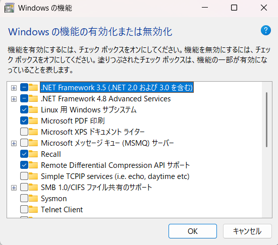
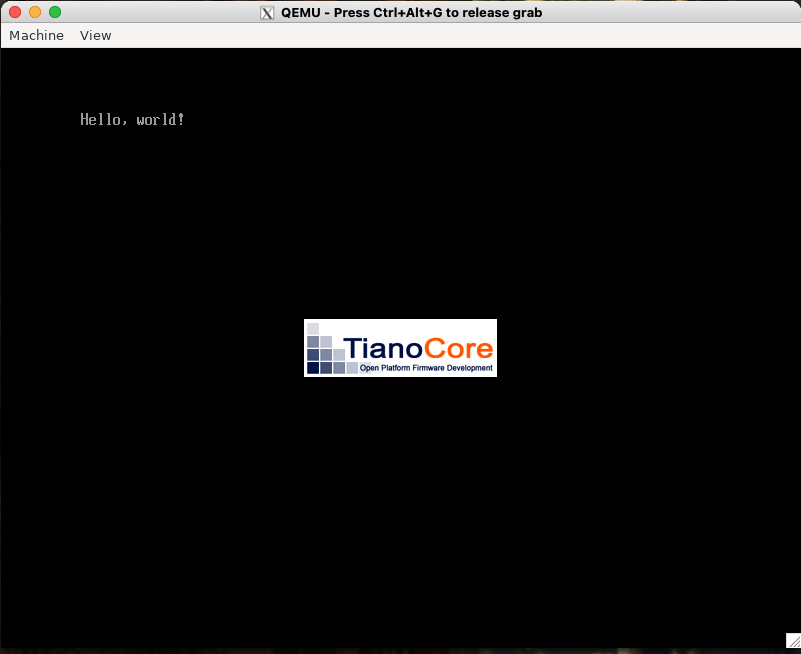

# Day 1. 環境構築と Hello World
まず最初に、OS の開発を行うエミュレータ環境の構築と、そのエミュレータ上で Hello World を表示するプログラムを作成します。
環境としては WSL 上の Ubuntu で QEMU を使用する構成を採用しました。

## 環境構築
初めに、WSL2 に Ubuntu をインストールします。
Windows のコントロールパネルから、「プログラム」→「プログラムと機能」→「Windows の機能の有効化または無効化」から、「Linux 用 Windows サブシステム」を有効にします。

<div align="center">
    
    <figcaption>図 1. 「Linux 用 Windows サブシステム」の有効化</figcaption>
</div>

パソコンを再起動して、PowerShell を管理者権限で立ち上げて、以下のコマンドを実行します。

```bash
$ wsl --install
$ wsl --install -d Ubuntu-24.04
```

しばらく待つと、WSL2 と Ubuntu 24.04 がインストールされます。
インストールが完了したら、スタート画面から Ubuntu アプリを立ち上げ、ユーザ名やパスワードを設定すれば WSL のセットアップは完了です。  
次に、必要なパッケージをインストールします。

```bash
# バイナリエディタとエミュレータ関連のパッケージ
$ sudo apt install okteta qemu-system dosfstools

#
```

## バイナリコードの作成
最初の一歩として、"Hello, world!" を表示するバイナリコードを作成します。
Okteta を立ち上げて次のようなファイルを作成し、```BOOTX64.EFI``` という名前で保存します。

```day01/BOOTX64.EFI```
```binary
00000000 4d 5a 00 00 00 00 00 00 00 00 00 00 00 00 00 00 |MZ..............|
*
00000030 00 00 00 00 00 00 00 00 00 00 00 00 80 00 00 00 |................|
*
00000080 50 45 00 00 64 86 02 00 00 00 00 00 00 00 00 00 |PE..d...........|
00000090 00 00 00 00 f0 00 22 02 0b 02 00 00 00 02 00 00 |......".........|
000000a0 00 02 00 00 00 00 00 00 00 10 00 00 00 10 00 00 |................|
000000b0 00 00 00 40 01 00 00 00 00 10 00 00 00 02 00 00 |...@............|
000000c0 00 00 00 00 00 00 00 00 06 00 00 00 00 00 00 00 |................|
000000d0 00 30 00 00 00 02 00 00 00 00 00 00 0a 00 60 81 |.0............`.|
000000e0 00 00 10 00 00 00 00 00 00 10 00 00 00 00 00 00 |................|
000000f0 00 00 10 00 00 00 00 00 00 10 00 00 00 00 00 00 |................|
00000100 00 00 00 00 10 00 00 00 00 00 00 00 00 00 00 00 |................|
*
00000180 00 00 00 00 00 00 00 00 2e 74 65 78 74 00 00 00 |.........text...|
00000190 14 00 00 00 00 10 00 00 00 02 00 00 00 02 00 00 |................|
000001a0 00 00 00 00 00 00 00 00 00 00 00 00 20 00 50 60 |............ .P`|
000001b0 2e 72 64 61 74 61 00 00 1c 00 00 00 00 20 00 00 |.rdata....... ..|
000001c0 00 02 00 00 00 04 00 00 00 00 00 00 00 00 00 00 |................|
000001d0 00 00 00 00 40 00 50 40 00 00 00 00 00 00 00 00 |....@.P@........|*
*
00000200 48 83 ec 28 48 8b 4a 40 48 8d 15 f1 0f 00 00 ff |H..(H.J@H.......|
00000210 51 08 eb fe 00 00 00 00 00 00 00 00 00 00 00 00 |Q...............|
*
00000400 48 00 65 00 6c 00 6c 00 6f 00 2c 00 20 00 77 00 |H.e.l.l.o.,. .w.|
00000410 6f 00 72 00 6c 00 64 00 21 00 00 00 00 00 00 00 |o.r.l.d.!.......|
```

```sum``` コマンドでチェックサムを確認して、下記と一致するかチェックします。
一致しない場合はどこか間違っているので、頑張っても間違っている箇所を探します。

```bash
$ sum BOOTX64.EFI
12430     2 BOOTX64.EFI
```

## QEMU での実行
作成したバイナリコードを用いて、QEMU で "Hello, world!" を表示します。
まずは、以下の手順でディスクイメージ  ```disk.img``` を作成します。

1. 200MB の空ファイルを作成し、FAT 形式でフォーマット
    ```bash
    $ qemu-img create -f raw disk.img 200M
    $ mkfs.fat -n 'MIKAN OS' -s 2 -f 2 -R 32 -F 32 disk.img
    ```
2. ```disk.img``` をマウントして ```BOOTX64.EFI``` を書き込み
    ```bash
    $ mkdir -p mnt
    $ sudo mount -o loop disk.img mnt
    $ sudo mkdir -p mnt/EFI/BOOT
    $ sudo cp BOOTX64.EFI mnt/EFI/BOOT/BOOTX64.EFI
    ```
3. ```disk.img``` をアンマウント
    ```bash
    $ sudo umount mnt
    $ rm -rf mnt
    ```

次のコマンドで、作成したディスクイメージから QEMU を起動します。
```OVMF_CODE.fd``` と ```OVMF_VARS.fd``` は QEMU を UEFI モードで起動させるために必要な設定ファイルです。
```mikanos/devenv/``` ディレクトリに用意してあります。

```bash
$ qemu-system-x86_64 -drive if=pflash,file=OVMF_CODE.fd -drive if=pflash,file=OVMF_VARS.fd -hda disk.img
```

これを実行すると、次のようなウィンドウが立ち上がり、"Hello, world!" と表示されます。

<div align="center">
    
    <figcaption>図 2. QEMU で表示された Hello, world!</figcaption>
</div>

以降、ディスクイメージを作成して QEMU で起動するという処理を幾度となく実行することになるので、上記をまとめたスクリプトを ```mikanos/devenv/run_qemu.sh``` に作成しておきます。
以下の通り、起動したい EFI ファイルを引数で指定して実行します。

```bash
$ run_qemu.sh ../day01/BOOTX64.EFI
```

## C/C++ を用いたプログラムの作成
バイナリコードで "Hello, world!" を表示することができましたが、OS をバイナリエディタで実装するのは現実的ではありません。
今後は C/C++ で実装を進めていきます。
その第一歩として、同様に "Hello, world!" を表示する C/C++ のプログラムを作成します。
mikanOS では C/C++ のコンパイラとして Clang、リンカとして LLD を使っているので、これらを Ubuntu にインストールしておきます。

```bash
$ sudo apt install -y clang lld
```

以下に示すコードが "Hello, world!" を表示する C 言語のコードです。
プログラムを実行すると、 ````EfiMain``` 関数が呼び出されて ```OutputString()``` でメッセージを表示しています。
このプログラム自体は、今後使うわけではないので、詳しい解説は省かれていました。

```c
typedef unsigned short CHAR16;
typedef unsigned long long EFI_STATUS;
typedef void *EFI_HANDLE;

struct _EFI_SIMPLE_TEXT_OUTPUT_PROTOCOL;
typedef EFI_STATUS (*EFI_TEXT_STRING)(
    struct _EFI_SIMPLE_TEXT_OUTPUT_PROTOCOL  *This,
    CHAR16                                   *String);

typedef struct _EFI_SIMPLE_TEXT_OUTPUT_PROTOCOL {
    void             *dummy;
    EFI_TEXT_STRING  OutputString;
} EFI_SIMPLE_TEXT_OUTPUT_PROTOCOL;

typedef struct {
    char                             dummy[52];
    EFI_HANDLE                       ConsoleOutHandle;
    EFI_SIMPLE_TEXT_OUTPUT_PROTOCOL  *ConOut;
} EFI_SYSTEM_TABLE;

EFI_STATUS EfiMain(EFI_HANDLE ImageHandle, EFI_SYSTEM_TABLE *SystemTable) {
  SystemTable->ConOut->OutputString(SystemTable->ConOut, L"Hello, world!\n");
  while (1);
  return 0;
}
```

次のようなコマンドでコンパイルとリンクを実行します。

```bash
$ clang -target x86_64-pc-win32-coff -mno-red-zone -fno-stack-protector -fshort-wchar -Wall -c hello.c
$ lld-link /subsystem:efi_application /entry:EfiMain /out:hello.efi hello.o
```

コンパイル時に ```-target x86_64-pc-win32-coff``` オプションを指定して COFF 形式でコンパイル結果を出力するように指定しています。
また、リンク時に ```/subsystem:efi_application``` オプションを指定することで、UEFI 用の PE 形式のファイル ```hello.efi``` が出力されます。
最後に、以下のコマンドを実行すると、先ほどと同じように "Hello, world!" が表示されます。

```bash
$ ../devenv/run_qemu.sh c/hello.efi
```