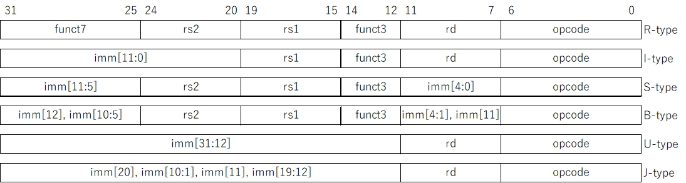

# RISC-V における命令実行と RV32I の命令形式
今回は、RISC-V 実装に向けて、RISC-V が命令を実行する手順を確認し、RV32I の命令形式を見ていきます。

## 命令実行のステージ
コンピュータ上で命令を1つ実行することを考えても、命令やデータをメモリから読み込んだり、演算を実行した結果をメモリに書き込んだり、さまざまな処理が必要となります。
一般的に、命令はいくつかのステージに分けらて実行されます。
組み込み用途の小型プロセッサでは3段程度、高性能プロセッサでは10段前後から可変の場合もありますが、これ以降の実装では5段階に分けて考えます。

1. 命令フェッチ (Instruction Fetch: IF)  
IF ステージでは、メモリに格納されている命令を読み出してきます。
命令を読み出してくるアドレスは、プログラムカウンタ (Program Counter: PC) と呼ばれるレジスタに格納されています。
RISC-V では、32本のレジスタとは別に PC 専用のレジスタが用意されており、実装を分けることでハードウェアを簡素化しています。

2. 命令デコード (Instruction Decode: ID)  
ID　ステージでは、0/1 のビット列である機械語から、命令の意味を解読 (デコード) します。
この解読方法を定義したのが命令セットアーキテクチャ (ISA) です。
RISC-V では、32ビットの命令のうち、0〜6ビット目は ```opcode``` と定められていますが、それ以外は命令の種類によって、レジスタのアドレスを指定したり即値を設定したリト、いくつかのパターンに分かれます。

3. 演算 (EXecution: EX)  
EX ステージでは、ID ステージのデコード結果を受けて、命令で指定された、四則演算やシフト演算などの処理を実行します。

4. メモリアクセス (MEMory access: MEM)  
MEM ステージでは、メモリへの書き出しや読み出しを行います。
RISC-V でメモリへのアクセスはロード命令とストア命令に限定され、算術演算やシフト演算を行う命令ではメモリにアクセスできません。
ロード・ストア命令では、直前の EX ステージで読み書きするメモリのアドレスを計算し、MEM ステージでメモリにアクセスします。
それ以外の命令では MEM ステージは稼働しません。

5. ライトバック (Write Back: WB)  
最後に、WB ステージで演算結果やメモリからのロード結果をレジスタに書き込みます。

## 命令のパイプライン化
通常、複数の命令を組み合わせることでプログラムが出来上がります。
命令を実行するときに、1個1個の命令を順番に実行すると、下の表のようなサイクルで実行することになります。

| サイクル | 1 | 2 | 3 | 4 | 5 | 6 | 7 | 8 | 9 | 10 | 11 | 12 | 13 | 14 | 15 |
| :--: | :--: | :--: | :--: | :--: | :--: | :--: | :--: | :--: | :--: | :--: | :--: | :--: | :--: | :--: | :--: |
| 命令1 | IF | ID | EX | MEM | WB |  |  |  |  |  |  |  |  |  |  |
| 命令2 |  |  |  |  |  | IF | ID | EX | MEM | WB |  |  |  |  |  |
| 命令3 |  |  |  |  |  |  |  |  |  |  | IF | ID | EX | MEM | WB |

プログラムの実行上は、これでも特に問題はありませんが、ハードウェアの利用効率が非常に悪くなります。
たとえば、命令2の IF ステージ実行中、他のステージを実行するハードウェアは全く利用されません。
そのため、3つの命令を処理するのに15サイクルもかかってしまいます。  
そこで、「命令1の ID ステージ処理中に、命令2の IF ステージの処理を実行する」、といったように利用されていないハードウェアを並列的に動かすことで利用効率を上げることができます。
これをパイプライン処理と呼び、上記のプログラムをパイプライン処理すると下の表のようになります。

| サイクル | 1 | 2 | 3 | 4 | 5 | 6 | 7 |
| :--: | :--: | :--: | :--: | :--: | :--: | :--: | :--: |
| 命令1 | IF | ID | EX | MEM | WB |  |  |
| 命令2 |  | IF | ID | EX | MEM | WB |  |
| 命令3 |  |  | IF | ID | EX | MEM | WB |

こうすることで、元の半分以下の7サイクルでプログラムが完了します。
実際のプログラムでは、条件分岐やデータハザードなどの阻害要因があるため、より複雑な制御が必要となりますが、それも含めて今後実装していく予定です。

## RV32I の命令形式
RISC-V は32ビットの固定長命令で、その中に命令の種類やレジスタのアドレスなどの情報を詰め込んでいます。
命令の形式には下の図に示すような R、I、S、B、U、J の6種類があります。

<div align="center">
    
</div>

- ```opcode```  
  すべての命令の下位7ビットに共通するフィールドで、これによって命令のクラスが決まる
- ```rs1```, ```rs2```, ```rd```  
  読み出し元のレジスタ (resister source) と書き出し先のレジスタ (resister destination) のアドレスを表す5ビットのフィールドで、32本のレジスタのうち、どのレジスタを読み書きするかを特定する
- ```funct3```, ```funct7```  
  ```opcode``` や一部の ```imm``` フィールドと組み合わせて命令の種類を特定する
- ```imm```  
  即値 (immediate) のことで、命令形式ごとに各フィールドの値を組み合わせて32ビットの値を生成する
  - I 形式: ```{{20{ir[31]}}, ir[31:20]}```  
    2の補数で表現される12ビットの数 ```ir[31:20]``` を32ビットに符号拡張 (```ir[31]```で埋める)
  - S 形式: ```{{20{ir[31]}}, ir[31:25], ir[11:7]}```  
    2の補数で表現される12ビットの数 ```{ir[31:25], ir[11:7]}``` を32ビットに符号拡張
  - B 形式: ```{{20{ir[31]}}, ir[7], ir[30:25], ir[11:8], 1'b0}```  
    ```{ir[31], ir[7], ir[30:25], ir[11:8]}``` の末尾に ```1'b0``` を追加し、32ビットに符号拡張
  - U 形式: ```{ir[31:12], 12'b0}```  
    ```ir[31:12]``` の末尾に12ビット分 ```0``` を連結
  - J 形式: ```{{12{ir[31]}}, ir[19:12], ir[20], ir[30:21], 1'b0}```  
    ```{ir[31], ir[19:12], ir[20], ir[30:21]}``` の末尾に ```1'b0``` を追加し、32ビットに符号拡張