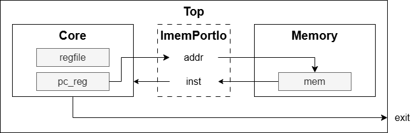

# 命令フェッチの実装 (Chisel 編)
まず最初に、CPU がメモリから命令データを取得する命令フェッチの回路を実装します。
具体的には、CPU の プログラムカウンタ (PC) レジスタに記憶されたアドレスをメモリに送信し、メモリは受信したアドレスに格納された命令データを CPU に返します。

## コードの構成
以下の3つのファイルに分けて実装を進めます。
また、各ファイルに定義するクラスも示します。

- Core.scala: CPU の本体を記述
  - Core: CPU の設計図
- Memory.scala: メモリを記述
  - Memory: メモリの設計図
  - ImemPortIo: CPUコアとメモリをつなぐ命令用ポートの設計図
- Top.scala: CPU とメモリを接続するラッパ
  - Top: コンピュータ全体の設計図

各クラスの構成を模式的に表すと以下のようになります。

<div align="center">
    
</div>

## 共通ファイルの準備
上記の実装に先立って、```riscv/chisel/chisel_template/src/main/scala/common/``` ディレクトリに今後の実装でも利用する共通のコードを用意しておきます。

### ```Instructions.scala```
命令セットの一覧を定義するファイルです。
まずは、RV32I の命令セットだけ定義しています。
```BitPat``` オブジェクトを使って各命令の bit 列を定義しています。

(一部抜粋)
```scala
package common

import chisel3.util._

object RV32I {
    // ロード・ストア命令
    val LB      = BitPat("b?????????????????000?????0000011")
    ...
    // 算術演算 (加減算) 命令
    val ADD     = BitPat("b0000000??????????000?????0110011")
    ...
    // 論理演算命令
    val AND     = BitPat("b0000000??????????111?????0110011")
    ...
    //シフト演算命令
    val SLL     = BitPat("b0000000??????????001?????0110011")
    ...
    // 比較演算命令
    val SLT     = BitPat("b0000000??????????010?????0110011")
    ...
    // 条件分岐命令
    val BEQ     = BitPat("b?????????????????000?????1100011")
    ...
    // ジャンプ命令
    val JAL     = BitPat("b?????????????????????????1101111")
    ...
    // 即値ロード命令
    val LUI     = BitPat("b?????????????????????????0110111")
    ...
    // CSR 命令
    val CSRRW   = BitPat("b?????????????????001?????1110011")
    ...
    // 例外命令
    val ECALL   = BitPat("b00000000000000000000000001110011")
    ...
}
```

### ```Consts.scala```
Chisel コード内で使用する定数を集めたファイルです。
各定数の意味は使用時に説明します。

(一部抜粋)
```scala
package common

import chisel3._


object Consts {
    val WORD_LEN      = 32
    val START_ADDR    = 0.U(WORD_LEN.W)
    ...
}
```

## Chisel の実装
それでは、最初に紹介したファイルごとに実装を見ていきましょう。
コード全体はソースファイルを参照してください。

### ```Top.scala```
CPU とメモリを統合する ```Top``` クラスを実装したファイルです。

```scala
class Top extends Module {
    ...
    // Core クラスと Memory クラスを new でインスタンス化し、Module でハードウェア化
    val core = Module(new Core())
    val memory = Module(new Memory())

    // core と memory の io を一括接続
    core.io.imem <> memory.io.imem
    ...
}
```

### ```Core.scala```
CPU 本体の実装を記述したファイルです。
命令フェッチの処理の流れは以下の通りです。

1. プログラムカウンタ (PC) レジスタ ```pc_reg``` を ```START_ADDR``` で初期化
2. クロックサイクルごとに PC レジスタの値を 4 (Byte) ずつカウントアップ
3. メモリへの出力ポート ```io.imem.addr``` に ```pc_reg``` を接続
4. 入力ポート ```io.imem.inst``` に渡された命令を ```inst``` で受ける

```scala
class Core extends Module {
    val io = IO(new Bundle {
        val imem = Flipped(new ImemPortIo())
        val exit = Output(Bool())
    })
    ... 
    val pc_reg = RegInit(START_ADDR)
    pc_reg := pc_reg + 4.U(WORD_LEN.W)

    io.imem.addr := pc_reg
    val inst = io.imem.inst

    io.exit := (inst === 0x34333231.U(WORD_LEN.W))
}
```

### ```Memory.scala```
メモリの実装を記述したファイルです。
また、命令データのやり取りを行う IO ポートのクラス ```ImemPortIo``` も定義しています。
メモリは 8bit 幅で、4アドレス分のデータを連接して命令データを取得します。
```loadMemoryFromFile``` はファイルからメモリにデータを読み込んでくるメソッドです。
書籍の中では相対パスでファイルを指定していますが、テストの際にうまくデータを読み込めませんでした。
そのため、プログラムで絶対パスを取得してからデータを読み込むように変更しました。

```scala
class ImemPortIo extends Bundle {
    val addr = Input(UInt(WORD_LEN.W))
    val inst = Output(UInt(WORD_LEN.W))
}

class Memory extends Module {
    val io = IO(new Bundle {
        val imem = new ImemPortIo()
    })

    // 16KiB のメモリを生成
    val mem = Mem(16384, UInt(8.W))

    // データをファイルからメモリにロード
    val relativePath = "src/hex/fetch.hex"
    val absolutePath = new File(relativePath).getAbsolutePath
    loadMemoryFromFile(mem, absolutePath)

    // 各アドレスの 8bit データをつなげて 32bit に整形
    io.imem.inst := Cat(
        mem(io.imem.addr + 3.U(WORD_LEN.W)),
        mem(io.imem.addr + 2.U(WORD_LEN.W)),
        mem(io.imem.addr + 1.U(WORD_LEN.W)),
        mem(io.imem.addr)
    )
}
```

## 命令フェッチのテスト
書籍では ChiselTest というツールを用いてテストを実施していますが、新しいバージョンの Chisel では ```chisel3.simulator``` に統合されました。
ここでは、統合されたパッケージを使ってテストを行います。

### テストコードの作成
```AnyFlatSpec``` トレイトを継承してテストを行うクラス ```HexTest``` を実装します。

```scala
class HexTest extends AnyFlatSpec {
    "mycpu" should "work through hex" in {
        simulate(new Top) { c =>
            // 明示的にリセットをかける
            c.reset.poke(true.B)
            c.clock.step(1)
            c.reset.poke(false.B)
            c.clock.step(1)
            
            // テスト内容を記述
            while (!c.io.exit.peek().litToBoolean) {
                c.clock.step(1)
            }
        }
    }
}
```

```AnyFlatSpac``` を継承したテストクラスでは、次のような文法で振る舞いを記述します。

```scala
"test target" should "expected " in {
    simulate(new TargetModule) { inst =>
        /* テスト内容 */
    }
}
```

テストの具体的な記述の前に、テスト対象のモジュールのインスタンスに対して、明示的にリセットをかけています。
```reset.poke``` でリセット信号に値をセットし、```clock.step``` でクロックを進めます。
これをしないと ```pc_reg``` におかしな値がセットされ、テストを正常に完了できなくなります。

```scala
c.reset.poke(true.B)
c.clock.step(1)
c.reset.poke(false.B)
c.clock.step(1)
```

テスト内容は、プログラムの終了信号 ```exit``` の値を ```peek``` メソッドで取得し、```exit``` 信号が ```true.B``` になるまでクロックを進めています。

```scala
while (!c.io.exit.peek().litToBoolean) {
    c.clock.step(1)
}
```

### デバッグ用のコードの追加
```Core.scala``` にメモリアドレスとメモリ出力を確認するため、以下のコードを追記して ```pc_reg``` と ```inst``` の値を表示するようにします。

```scala
printf(p"pc_reg: 0x${Hexadecimal(pc_reg)}\n")
printf(p"inst: 0x${Hexadecimal(inst)}\n")
printf("----------\n")
```

### メモリ用 hex ファイルの作成
```src/hex/fetch.hex``` を作成し、以下の内容を記述します。

```hex
11
12
13
14
21
22
23
24
31
32
33
34
```

1行ごとに8ビットずつデータを配置します。
メモリでは32ビット分をまとめてデータとして出力するので、メモリアドレスと ```Memory``` モジュールの出力は以下のようになります。

| メモリアドレス | 出力データ |
| :--: | :--: |
| 0 | 14131211 |
| 4 | 24232221 |
| 8 | 34333231 |

### テストの実行
テストの実行に必要なパッケージ等は ```build.sbt``` ファイルに記述されています。
今回は chisel-template で用意されているものをそのまま利用しました。
また、テストは ```sbt``` コマンドを使って、対象のテストを ```packageName.TestClass``` という形式で指定して実行します。

```bash
$ docker exec -it riscv_container /bin/bash

# コンテナ内で実行
$ cd riscv/chisel/chisel-template
$ sbt "testOnly fetch.HexTest"
[info] welcome to sbt 1.12.4 (Ubuntu Java 21.0.10)
[info] loading settings for project chisel-template-build from plugins.sbt...
[info] loading project definition from /work/riscv/chisel/chisel-template/project
[info] loading settings for project root from build.sbt...
[info] set current project to %NAME% (in build file:/work/riscv/chisel/chisel-template/)
[info] compiling 1 Scala source to /work/riscv/chisel/chisel-template/target/scala-2.13/test-classes ...
pc_reg: 0x00000000
inst: 0x14131211
----------
pc_reg: 0x00000004
inst: 0x24232221
----------
[info] HexTest:
[info] mycpu
[info] - should work through hex
[info] Run completed in 3 seconds, 750 milliseconds.
[info] Total number of tests run: 1
[info] Suites: completed 1, aborted 0
[info] Tests: succeeded 1, failed 0, canceled 0, ignored 0, pending 0
[info] All tests passed.
[success] Total time: 7 s, completed May 4, 2026, 8:22:45 AM
```

なぜか最後のクロックで読み込まれるデータが表示されませんが、命令フェッチは正しく動いていそうです。