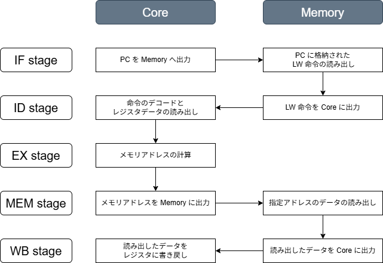

# LW 命令の実装 (Chisel 編)
前回、前々回で命令のフェッチとデコードを実装できたので、ここからは具体的な命令の実装を行います。
まずは、レジスタから 1 word (= 32bit) 分データを読み込む LW (Load Word) 命令を実装していきます。

## LW 命令の定義
LW 命令は I 形式の命令で、即値を ```imm_i``` と表現します。
LW 命令のビットアサインとアセンブリ表現は以下の通りです。

| 31-20 | 19-15 | 14-12 | 11-7| 6-0 |
| :--: | :--: | :--: | :--: | :--: |
| imm_i[11:0] | rs1 | 010 | rd | 0000011 |

```
lw rd, offset(rs1)
```

具体的には、```rs1``` 番地のレジスタデータに ```sext(imm_i)``` を加算した番地にあるメモリ上のデータを、```rd``` 番地のレジスタに書き込む処理を行います。
レジスタ配列を $x$、メモリ配列を $M$、符号拡張演算 $sext$ を用いて、演算内容を以下のようにあらわすことができます。

$$
x[rd] = M \big[ x[rs1] + sext(imm\_i) \big]
$$

## Chisel の実装
各ステージにおける処理内容は以下の通りです。

<div align="center">
    
</div>

### 命令ビットパターンの定義
命令のビットパターンは ```Instructions.scala``` に定義した通りです。

```riscv/chisel/chisel-template/src/main/scala/common/Instructions.scala```
```scala
package common

import chisel3.util._

object RV32I {
    ...
    val LW      = BitPat("b?????????????????010?????0000011")
    ...
}
```

### CPU・メモリ間のポート定義
命令をやり取りする IO ポート ```ImemPortIO``` とは別に、データ用の IO ポート ```DmemPortIO``` を用意します。
```addr``` で指定されたデータを ```rdata``` に格納して、```Core``` と ```Memory``` の間でデータをやり取りしています。

```riscv/chisel/chisel-template/src/main/scala/Memory.scala```
```scala
package rv32cpu

// データ用の IO ポート
class DmemPortIo extends Bundle {
    val addr  = Input(UInt(WORD_LEN.W))
    val rdata = Output(UInt(WORD_LEN.W))
}
```

```Core```、```Memory``` の双方に ```io``` を追加しておきます。

```riscv/chisel/chisel-template/src/main/scala/Core.scala```
```scala
val io = IO(new Bundle {
    val imem = Flipped(new ImemPortIo())
    val dmem = Flipped(new DmemPortIo())
    val exit = Output(Bool())
})
```

```riscv/chisel/chisel-template/src/main/scala/Memory.scala```
```scala
val io = IO(new Bundle {
    val imem = new ImemPortIo()
    val dmem = new DmemPortIo()
})
```

さらに、```Top.scala``` で CPU とメモリのデータ用 IO ポートを接続します。

```riscv/chisel/chisel-template/src/main/scala/Top.scala```
```scala
core.io.dmem <> memory.io.dmem
```

### CPU 内部の処理の実装
#### ```offset``` の符号拡張 @ ID ステージ
まず、命令デコードの続きで 12 ビットの LW 命令の即値 ```imm_i``` を符号拡張して、32ビットに変換します。
```Fill(20, imm_i(11))``` と ```imem_i``` を ```Cat``` で結合して、```imm_i``` の最上位ビットを20回繰り返し、32ビットの上位20ビットを埋める処理をしています。

```riscv/chisel/chisel-template/src/main/scala/Core.scala```
```scala
val imem_i = inst(31, 20)
val imem_i_sext = Cat(Fill(20, imem_i(11)), imem_i)
```

#### メモリアドレスの計算 @ EX ステージ
次に EX ステージでメモリアドレスを計算します。
計算式は上で示したように $x[rs1] + sext(imm\_i)$ です。
演算は ALU (Arithmetic Logic Unit) で実行されますが、これは ```MuxCase``` を使って実装します。
計算結果は ```alu_out``` 信号に格納します。

```riscv/chisel/chisel-template/src/main/scala/Core.scala```
```scala
val alu_out = MuxCase(0.U(WORD_LEN.W), Seq(
    (inst === LW) -> (rs1_data + imem_i_sext)
))
```

```rs1_addr``` や ```imem_i_sext``` の値によってはアドレス値がオーバフローして桁あふれが発生する可能性があります。
ただし、RISC-V では加算結果が被演算子よりも小さくなっていないかをソフトウェア的に確認することで、オーバフローの有無を判別します。

#### アドレス信号の接続 @ MEM ステージ
EX ステージで計算されたメモリアドレスをメモリに渡します。
読み出したデータをどう利用するかは以降のステージの実装次第で、使わないまま命令の処理を終了しても問題ないため、常時メモリからデータが供給される実装になっています。

```riscv/chisel/chisel-template/src/main/scala/Core.scala```
```scala
io.dmem.addr := alu_out
```

#### ロードデータのレジスタライトバック @ WB ステージ
最後に、メモリからロードしたデータをレジスタにライトバックします。

```riscv/chisel/chisel-template/src/main/scala/Core.scala```
```scala
val wb_data = io.dmem.rdata
when(inst === LW) {
    regfile(wb_addr) := wb_data
}
```

### メモリのデータ読み込み
```io.imem.inst``` と同様、8ビットのデータを4個つなげて1ワード (32ビット) のデータを作ります。

```riscv/chisel/chisel-template/src/main/scala/Memory.scala```
```scala
io.dmem.rdata := Cat(
    mem(io.dmem.addr + 3.U(WORD_LEN.W)),
    mem(io.dmem.addr + 2.U(WORD_LEN.W)),
    mem(io.dmem.addr + 1.U(WORD_LEN.W)),
    mem(io.dmem.addr)
)
```

## テストの実行
### 命令ファイルの準備
命令ファイル ```riscv/chisel/chisel-template/src/hex/lw.hex``` を作成します。

```hex
03
23
80
00
11
12
13
14
22
22
22
22
```

アドレスとデータの対応関係は以下の通りです。

| アドレス | データ |
| :--: | :--: |
| 0 | 00802303 |
| 4 | 14131211 |
| 8 | 22222222 |

アドレス 0 に格納されたデータが LW 命令を表しています。

| 31～20 | 19～15 | 14～12 | 11～7 | 6～0 |
| :--: | :--: | :--: | :--: | :--: |
| imm_i[11:0] | rs1 | 010 | rd | 0000011 |
| 000000001000 | 00000 | 010 | 00110 | 0000011 |

$x[rd] = M \big[ x[rs1] + sext(imm\_i) \big]$ に当てはめると、8番地のデータ (0x22222222) を6番レジスタに格納するという処理 ($x[6] = M[ x[0] + 8 ]$) になります。

### 細々とした修正
まずは、テストで読み込むファイルを ```fetch.hex``` から ```lw.hex``` に変更します。

```riscv/chisel/chisel-template/src/main/scala/Memory.scala```
```scala
loadMemoryFromFile(mem, "src/hex/lw.hex")
```

次に、テストの終了条件を変更します。

```riscv/chisel/chisel-template/src/main/scala/Core.scala```
```scala
io.exit := (inst === 0x14131211.U(WORD_LEN.W))
```

最後に、デバッグ用信号を追加します。

```scala
printf(p"wb_data  : 0x${Hexadecimal(wb_data)}･n")
printf(p"dmem.addr: ${io.dmem.addr}･n")
```

### テストの実行
以下のコマンドでテストを実行します。

```bash
$ docker exec -it riscv_container /bin/bash

# コンテナ内
$ cd chisel/chisel-template
$ sbt "testOnly rv32cpu.HexTest"
```

以下のような結果が出力されました。
2サイクル目に実行される命令 ```0x14131211``` は、1サイクル目でレジスタ6番地に書き込まれたデータを読み込んでくる命令です。
たしかに、```0x222222``` がレジスタ6番地から読み出していることがわかります。

```bash
pc_reg    : 0x00000000
inst      : 0x00802303
rs1_addr  :  0
rs2_addr  :  8
wb_addr   :  6
rs1_data  : 0x00000000
rs2_data  : 0x13d5ba78
wb_data   : 0x22222222
dmem.addr :          8
----------
pc_reg    : 0x00000004
inst      : 0x14131211
rs1_addr  :  6
rs2_addr  :  1
wb_addr   :  4
rs1_data  : 0x22222222
rs2_data  : 0xa107c0d1
wb_data   : 0x00802303
dmem.addr :          0
----------
```

今回は以上です。