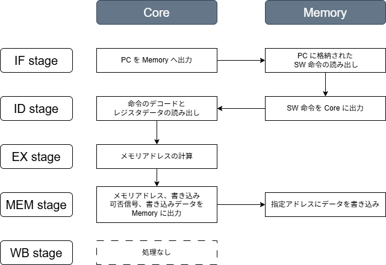

# SW 命令の実装 (Chisel 編)
メモリからデータを読み出す LW 命令を実装したので、メモリにデータを保存する SW (Store Word) 命令も実装していきます。

## SW 命令の定義
SW 命令は 1 word 32 bit のレジスタデータをメモリに書き込む命令です。
LW 命令と対をなす命令ではありますが、LW 命令は I 形式である一方、SW 命令は S 形式の命令になります。
具体的なビットアサインは以下の通りで、レジスタアドレスを2つ指定するため、即値が2か所に分かれて指定されています。

| 31-25 | 24-20 | 19-15 | 14-12 | 11-7 | 6-0 |
| :--: | :--: | :--: | :--: | :--: | :--: |
| imm_s[11:5] | rs2 | rs1 | 010 | imm_s[4:0] | 0100011 |

SW 命令では、```rs1``` 番地のレジスタデータに ```imm_s``` でオフセットをかけたメモリアドレスに ```rs2``` 番地のレジスタデータを書き込みます。
SW 命令のアセンブリ表現と演算内容は次の通りです。

```
sw rs2, offset(rs1)
```

$$
M \big[ x[rs1] + sext(imm\_s) \big] = x[rs2]
$$

## Chisel の実装
各ステージにおける処理内容は以下の通りです。

<div align="center">
    
</div>

### 命令 bit パターンの定義
LW 命令と同様に、```Instructons.scale``` に SW 命令のビットパターンを定義します。

```riscv/chisel/chisel-template/src/main/scala/common/Instructions.scala```
```scala
object RV32I {
    ...
    val SW      = BitPat("b?????????????????010?????0100011")
    ...
}
```

### CPU とメモリ間のポート定義
LW 命令の実装で追加した ```DmemPortIo``` クラスに、書き込み可否信号 ```wen``` と書き込みデータ信号 ```wdata``` の2種類の ```Input``` ポートを追加します。
SW 信号では、メモリへの書き込みに伴ってメモリ内部のデータの実態に影響を及ぼすものであるため、```wen``` 信号によってタイミングを制御します。

```riscv/chisel/chisel-template/src/main/scala/Memory.scala```
```scala
package rv32cpu

// データ用の IO ポート
class DmemPortIo extends Bundle {
    ...
    val wen   = Input(Bool())
    val wdata = Input(UInt(WORD_LEN.W))
}
```

### CPU 内の処理実装
#### 即値のデコード @ ID ステージ
31ビット目から25ビット目、および11ビット目から7ビット目を連結して 12ビットの即値 ```imm_s``` を取得します。
さらに、先頭20ビットを ```imm_s[11]``` の値で埋めてアドレスのオフセットを計算します。

```riscv/chisel/chisel-template/src/main/scala/Core.scala```
```scala
val imm_s = Cat(inst(31, 25), inst(11, 7))
val imm_s_sext = Cat(Fill(20, imm_s(11)), imm_s)
```

#### メモリアドレスの計算 @ EX ステージ
ALU で ```rs1``` 番地のレジスタデータと ```imm_s_sext``` から書き込み先のメモリアドレスを計算します。

```riscv/chisel/chisel-template/src/main/scala/Core.scala```
```scala
val alu_out = MuxCase(0.U(WORD_LEN.W), Seq(
    (inst === LW) -> (rs1_data + imm_i_sext),
    (inst === SW) -> (rs1_data + imm_s_sext)
))
```

#### メモリポートとの信号の接続 @ MEM ステージ
メモリ書き込み用のポートに信号を接続します。
```wen``` は命令 ```inst``` が ```SW``` 命令の時にだけ ```true.B``` になり、ほかの命令のでは書き込みが発生しないように制御します。

```riscv/chisel/chisel-template/src/main/scala/Core.scala```
```scala
io.dmem.wen   := (input == SW)
io.dmem.wdata := rs2_data
```

#### メモリデータの書き込み
```Memory``` クラスで ```Core``` から出力されたデータを8ビットずつに区切って各メモリアドレスに書き込みます。

```riscv/chisel/chisel-template/src/main/scala/Memory.scala```
```scala
when(io.dmem.wen) {
    mem(io.dmem.addr)       := io.dmem.wdata( 7,  0)
    mem(io.dmem.addr + 1.U) := io.dmem.wdata(15,  8)
    mem(io.dmem.addr + 2.U) := io.dmem.wdata(23, 16)
    mem(io.dmem.addr + 3.U) := io.dmem.wdata(31, 24)
}
```

## テストの実行
### 命令ファイル ```sw.hex``` の作成
命令ファイル ```riscv/chisel/chisel-template/src/hex/sw.hex``` を作成します。

```hex
03
23
80
00
23
28
60
00
22
22
22
22
```

アドレスとデータの対応関係は以下の通りです。

| アドレス | データ |
| :--: | :--: |
| 0 | 00802303 |
| 4 | 00602823 |
| 8 | 22222222 |

1つ目の命令は LW 命令で、メモリアドレス 8 のデータ ```0x22222222``` を6番レジスタに読み込む命令です。
2つ目の命令を S 形式で書き下すと以下のようになります。

| 31-25 | 24-20 | 19-15 | 14-12 | 11-7 | 6-0 |
| :--: | :--: | :--: | :--: | :--: | :--: |
| imm_s[11:5] | rs2 | rs1 | 010 | rd | 0000011 |
| 0000000 | 00110 | 00000 | 010 | 10000 | 0100011 |

$M \big[ x[rs1] + sext(imm\_s) \big] = x[rd]$ に当てはめると、8番地のデータ (0x22222222) を6番レジスタに格納するという処理 ($M[ x[0] + sext(16) ] = x[6]$) になります。

### 細々とした修正
まずは、テストで読み込むファイルを ```lw.hex``` から ```sw.hex``` に変更します。

```riscv/chisel/chisel-template/src/main/scala/Memory.scala```
```scala
loadMemoryFromFile(mem, "src/hex/sw.hex")
```

次に、テストの終了条件を変更します。

```riscv/chisel/chisel-template/src/main/scala/Core.scala```
```scala
io.exit := (inst === 0x00602823.U(WORD_LEN.W))
```

最後に、デバッグ用信号を追加します。

```scala
printf(p"dmem.wen  : ${io.dmem.wen}\n")
printf(p"dmem.wdata: 0x${Hexadecimal(io.dmem.wdata)}\n")
```

### テストの実行
以下のコマンドでテストを実行します。

```bash
$ docker exec -it riscv_container /bin/bash

# コンテナ内
$ cd chisel/chisel-template
$ sbt "testOnly rv32cpu.HexTest"
```

以下のような結果が出力されました。
2サイクル目に実行される命令 ```0x14131211``` は、1サイクル目でレジスタ6番地に書き込まれたデータを読み込んでくる命令です。
たしかに、```0x222222``` がレジスタ6番地から読み出していることがわかります。

```bash
pc_reg    : 0x00000000
inst      : 0x00802303
rs1_addr  :  0.HexTest 2s
rs2_addr  :  8
wb_addr   :  6
rs1_data  : 0x00000000
rs2_data  : 0x13d5ba78
wb_data   : 0x22222222
dmem.addr :          8
dmem.wen  : 0
dmem.wdata: 0x13d5ba78
----------
pc_reg    : 0x00000004
inst      : 0x00602823
rs1_addr  :  0
rs2_addr  :  6
wb_addr   : 16
rs1_data  : 0x00000000
rs2_data  : 0x22222222
wb_data   : 0xcd086684
dmem.addr :         16
dmem.wen  : 1
dmem.wdata: 0x22222222
----------
```

今回は以上です。